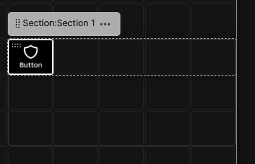
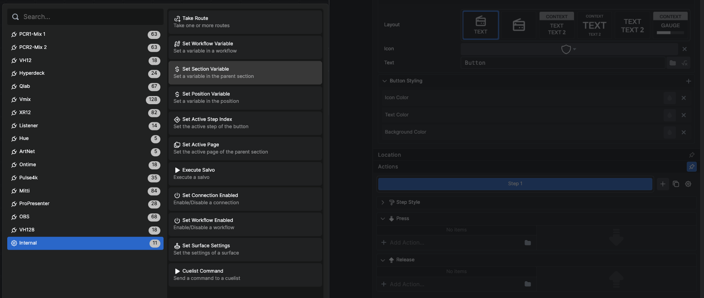
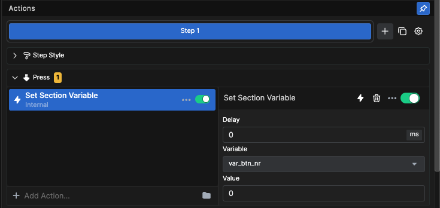
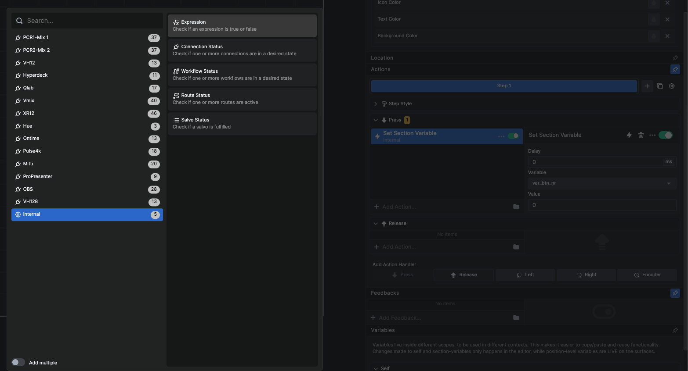
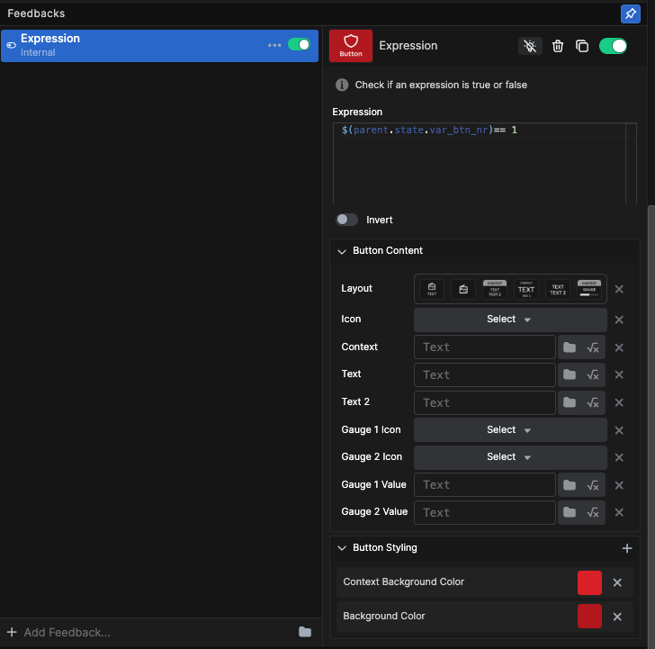
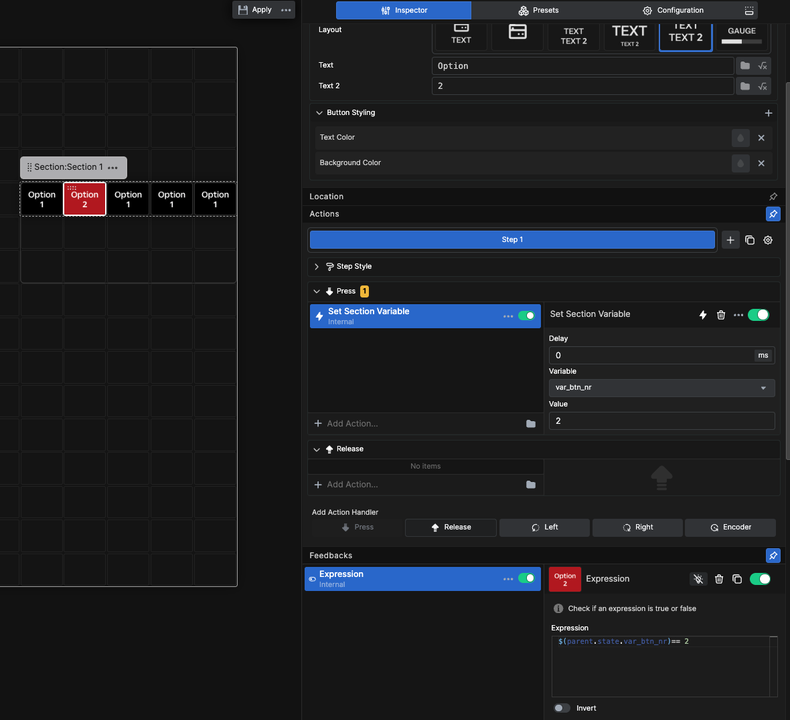
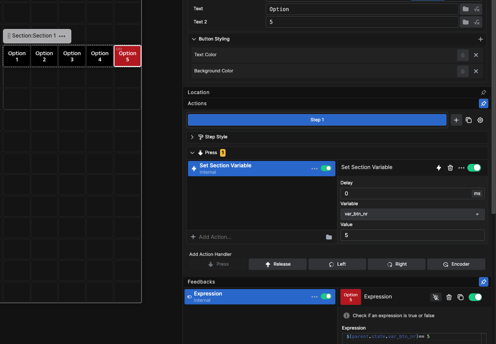
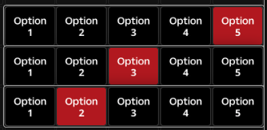

**Examples**

Radio button set with section variable 

In this example we will use a section variable, an internal action, and the internal expression feedback to create a Radio button set. Radio buttons is a set of buttons where only one button can be active at the time. A name given by a typical function on old radios where pressing one button would mechanical release any other selected button.

  
We will start by making a section with a button inside.

 
Next we will select the Section and make a self variable inside the section
the full variable name will be `$(self.state.var_btn_nr)`

  
Next we select the button and browse for the internal action "Set Section Variable"

Configure the action with the variable we created earlier. And set the Value of the variable to 1

Next we will add the internal Expression feedback.

Configure the expression box with the following expression `$(parent.state.var_btn_nr)== 1`
Note that the expression is looking at the **Self variable** of the Parent object in this case the **Section**
You can configure the rest of the feedback as you wish with all options for content and styling.

Now let us just change the style of the button with a label and a number.

Next copy and paste the button so that we have 5 buttons, and select the second button.

Change the Number label, Action Value, end the number in the Expression to 2 for the second button.

Now do the same for button 3,4 and 5, and we are done. 

We now have a set of 5 buttons with feedback that only will be "true" for 1 of the buttons at any given time. You can add actions like input selectors, folder navigation or whatever else a Radio button set would be useful for.

Since this Radio button set uses a Section variable the feedback is fully isolated to the section, and you can make a copy of the whole section and reuse it for other purposes. Even though the variable name is the same in every copy of the set, they will not affect each other.

Next we will make a Radio button set using a Workflow variable and explore the differences between the 2.