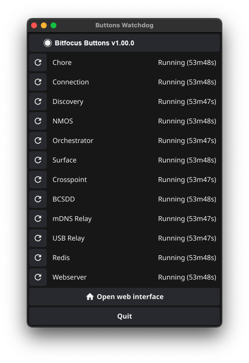

- Connect the hardware and software that you want to control to the network.

### Make sure you have read through the [Buttons Beta Information](https://bitfocus.notion.site/Beta-Information-66a37157322e4d8aabfbd4f76edc4909?pvs=25)

---

## Starting buttons

When you start **Buttons**, a window pops up displaying all the running processes. From this window, you can restart any processes that aren’t running. You can also open the web interface here, and it’s the right place to quit **Buttons** if needed.

---