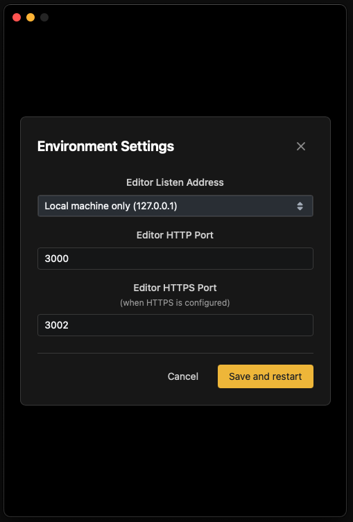

Connect the hardware and software you want to control to the network.

### Release notes.

Have a look at the [release notes.](https://bitfocus.notion.site/Buttons-1-0-Hello-Production-1a4d78a0191a805cb4f5c8032c92496a), to keep on top of the changes in Buttons 

There is also a lot of great information on the [Buttons Beta Information](https://bitfocus.notion.site/Beta-Information-66a37157322e4d8aabfbd4f76edc4909?pvs=25) page

---

## Starting buttons

When you start **Buttons**, a window pops up displaying all the running processes. From this window, you can restart any processes that aren’t running. You can also open the web interface here, and it’s the right place to quit **Buttons** if needed.

Under the settings cogwheel you will find some environment settings.

The **Editor Listen Address** will let you limit on which network the Buttons management UI will be available.

You can also change which port the management UI will use for both HTTP and HTTPS. 

---