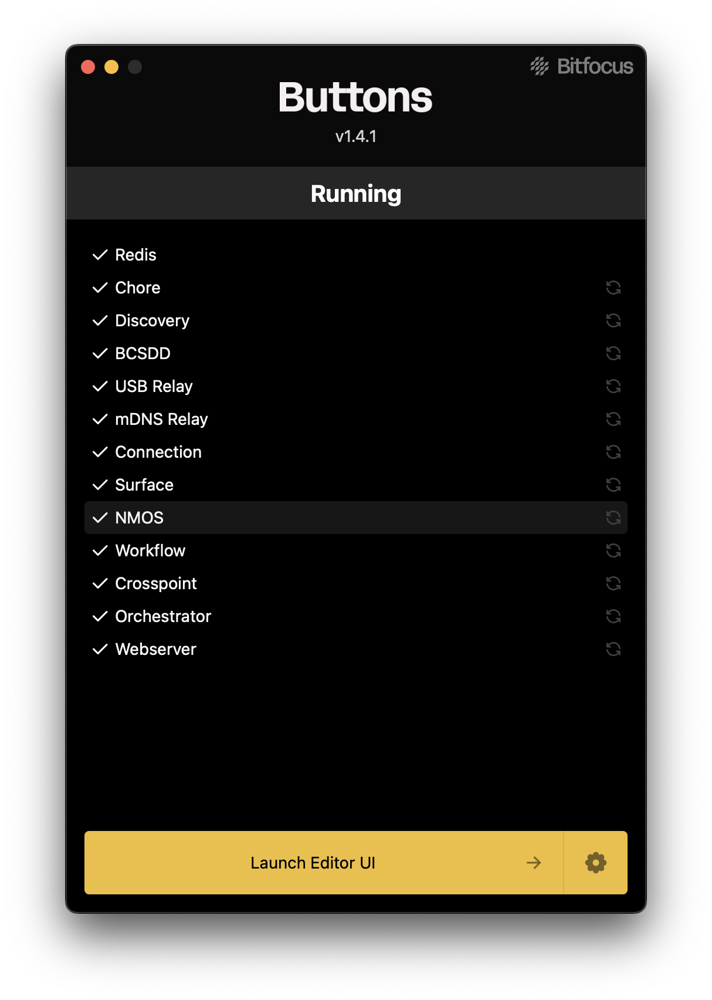

 
 - For itemized lists 
 - A second item in the list

 1. numbered list
 2. Second item

 ---
  

**BOLD**
Used on keywords referring to key functions, buttons, panes or windows within Buttons


*ITALICS*
Used for Keyboard or Mouse functions

---

`Fenced Text`
Used for Text or Code blocks or a chain of commands, clicks or button presses


```typescript
export async function parsePresetVariableOption(
	options: CompanionOptionValues,
	context: CompanionActionContext,
): Promise<CompanionOptionValues | string> {
	const presetStr = String(options.val)
	const preset = parseInt(await context.parseVariablesInString(presetStr), 10)

	if (Number.isNaN(preset) || !isValidPreset(preset)) {
		return `Invalid recall preset value of: ${presetStr}`
	} else {
		return { val: twoDigitHex(preset) }
	}
}
```
Also used inline in text to distinguish a chain of buttons to press or a combination of Buttons and Mouse actions
from the rest of the text
_`CTRL+ALT+DEL`_ 
_`CTRL+Click`_

---

**Images**


_Caption for the image Works best with images without a huge drop shadow_

---
Use blockquotes for tips or additional short form information
>
> **Quick tip**
> Use **Tags** to organize your different **Surfaces** in to logical groups 
>
---
For links in the document 

This is a proper link to [https://bitfocus.io](https://bitfocus.io)

If you are showing a link just as a reference and don't want it to work use back tics

This is a non-working link `https://bitfocus.io`

___
For a horizontal line as used in this document use 3 dashes
___