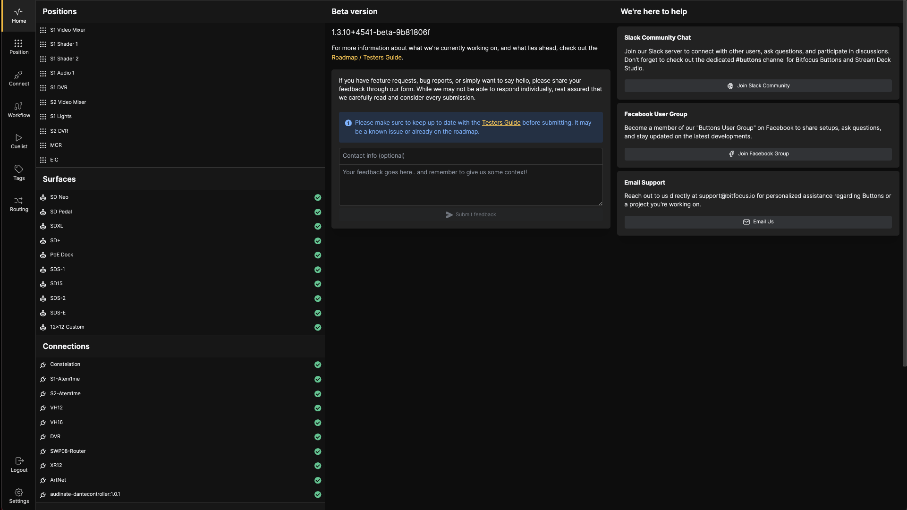

## Home Screen

On the far left, we have the menu bar. Here you can see the different pages available in buttons:
- **Home Screen**: The current page
- **Position Page**: The Position configuration page
- **Connect**: The Connect configuration page
    - **Connections**: Where all the Hardware, Software and Services are configured
    - **NMOS**: NMOS, 2110 Configuration page
    - **Surface**: Where all the control surfaces are connected and configured 
- **Workflow**: The Workflow configuration page

- **Cuelist**: The Cuelist Configuration and execution page
- **Tags**: The Tags configuration page
- **Routing**: The Routing configuration page
    - **Route**: The Route UI where you can set up and execute Routes and Create and execute Salvos
    - **Salvo**: The Salvo UI for creating, executing and editing salvos
    - **Labels**: UI for setting user labels for the Routing system
    - **Config**: An overview over all Ports and Bundles can be viewed  
- **Log Out**: Will log you out of the Buttons UIv
- **Settings**: The system configuration page

To the right, the center panes shows currently configured and active components, and their status.
- **Positions**: Displays all configured positions
- **Surfaces**: Displays the control surfaces
- **Connections**: Displays all non NMOS  connections
- **NMOS**: Displays all NMOS connections
- **Workflows**: Displays all configured Workflows
- **Cuelist**: Displays all configured Cuelists

On the rightmost pane, you'll find version information and support options:
- **Version information**
- **Feedback box**: For sending feedback to Bitfocus. Please do not use this option for support requirements.
- **Slack community**: Chat with developers and users worldwide
- **Facebook group**: Join the Bitfocus community on Facebook
- **Email**: Contact support@bitfocus.io directly

---