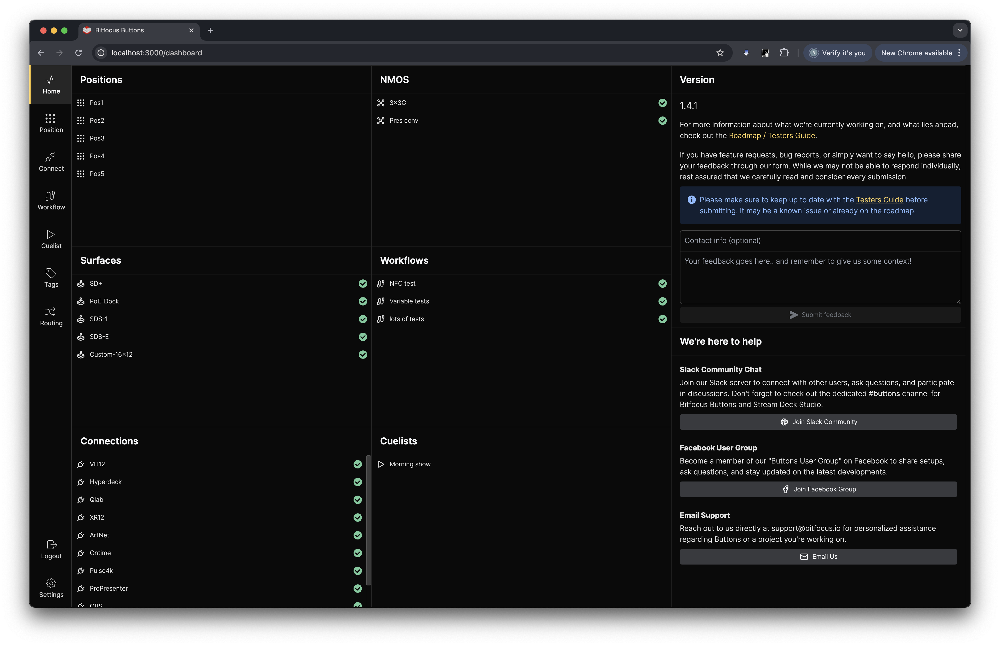

## Home Screen

On the far left, we have the menu bar. Here you can see the different pages available in buttons:
- **Home Screen**: The current page
- **Surface Page**: The Surface configuration page
- **Position Page**:The Position configuration page
- **Connections**: The Connection configuration page
- **Tags**: The Tags configuration page
- **Routing**: The Routing configuraton page
- **Log Out**: Will log you out of the Buttons UI
- **Settings**: The system configuration page

To the right, the leftmost pane includes:
- **Positions**: Displays all arranged positions
- **Surfaces**: Shows the control surfaces
- **Connections**: Displays all available connections
- **NMOS**: Specifically shows NMOS connections

The middle pane provides:
- **Version information**
- **Feedback box**: For sending feedback to Bitfocus. Please do not use this option for support requirements.

On the rightmost pane, you'll find support options:
- **Slack community**: Chat with developers and users worldwide
- **Facebook group**: Join the Bitfocus community on Facebook
- **Email**: Contact support@bitfocus.io directly

---