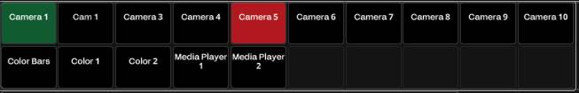

A **Button** is a fundamental action handler. You push it, and something happens. It has many properties, which we will explore step by step.

The first thing to notice is the *8 dots* in the top-left corner of a selected **Button**. This is the *Handle Bar*. When you hover over it, your mouse will change to an open hand, allowing you to click and drag the button around the **Canvas**.

### **Button Properties Overview**
- **Label**: The name of the **Button** displayed in the tree view.
- **Style**: Determines the layout of the **Button**:
  - Icon and one line of text (Default).
  - Icon only.
  - Three lines of text where the top line has distinct color properties.
  - Three lines of text where the middle line is larger than the others.
  - Two lines of text
  - Two lines of text two icons and two gauge bars

- **Icon**: Select an icon from a dropdown or use the search bar.  
  You can also click the `x` to upload a **PNG** file as an icon.

**Upload**

  
The up arrow after the search box lets you browse for PNG files to be used as custom icons,  
and the settings cog wheel will bring up the custom icon library

### **Text Fields**
Text fields depend on the chosen button style:  

- **Context**: The top line in the third and fourth styles.
- **Text**: The middle line in the third and fourth styles (or the only line in the first style).
- **Text 2**: The bottom line in the third and fourth styles.

Each text box includes a **Variable Selector** button, which opens a dialog for browsing and selecting available system variables.

  
  

The text fields in Buttons also have an Expression mode, which lets you build expressions based on variables math and functions.  
There is a built-in expression builder which will present suggestions as you type out the expression

### **Styling**

- Under styling, you can adjust various styling options for the button like: 
  - Color, Font size, text wrap, text scroll, and blink.
  - If any of the options is missing click on the + sign at the top of the styling section and add the option you would like 

  

### **Location**

- **Flow** determines button behavior and positioning:
  - **Float**: Positions dynamically, starting from top-left.
  - **Static**: Allows full customization by setting X/Y coordinates (Default).
  - **Anchor**: Automatically positions the button in corners, allowing resizing.
  - **Fixed**: Similar to anchor but unaffected by scrolling.

---

### **Action Handling**

Actions connect the **Button** to **Connections** or internal functions. Action handlers include:
- **Press**: Executes when the button is pressed.
- **Release**: Executes when released.
- **Left/Right**: Assigns an action to the left rotation and another to the right rotation on the **Stream Deck Studio and Stream Deck Plus**.
- **Encoder**: Assigns both left and right rotations to a single Action and the Delta is used to adjust the value of the action **Stream Deck Studio and Stream Deck Plus**.

For example, we’ll use the *Press Action Handler*:  

1. You can search Directly in the *+ Add Action* field, or you can click on the folder at the end to bring up the Action selection dialog box.  

  

**Example:** Select *ME:Set Program Input*. The button will set the Atem switcher’s M/E 1 bus to input "MV Loop1".  

  

### **Action Steps**
Buttons can act as playlists, performing multiple actions sequentially:  
  
- Add steps by clicking the *+* after *Step 1*. Or you could use the duplicate step button on the step you are on.
- Each step has unique **Style** and **Action** dialogs.  
- Under the **cogwheel** you find an option to set auto-progress, each press of the button will then advance to the next step in line.
- There is also an option to use Absolute or relative delays.
- You can rename the steps by double-clicking on the step, this will bring up a dialog box where you can change the name of the step.

Delays can be set to **Absolute** or **Relative**:  
- **Absolute**: Actions start a set time after button press (Default).  
    
- **Relative**: Each action runs a set time after the previous one starts.  
   

There is also an option to reorder the steps. This will bring up a dialog box where you can drag the steps in to the position you need.

  

When clicking on the +Add Action, you are presented with a selection of recently used actions and a option to create a **ActionGroup** or **Actionlogic**

The **ActionGroup** lets you group different actions together either for Sequential or Concurrent execution

The **ActionLogic** lets you make Conditional actions or in other words let yo make actions that only executes if certain conditions are met.

For condition, you can use any feedback or use an expression to test a variable for a value.  
In this example we test the `$(time.hh)` variable for a value larger than or equal to 12 on a 24-hour clock.  
Or whether the time is after noon giving a **true** value which will trigger the **When true** action.   
Or before noon giving a **false** value which will trigger the **Else** action.

If the time is between 12:00 and 23:59, pressing the button will set the light to 255 or 100%

If the Time is between 00:00 and 11:59. Pressing the button will sett the light to 128 or approx 50%.

This is just a simple example of how you can use **ActionLogic**, there are many possible uses for conditional logic in execution of actions.  
You can also stack multiple **ActionLogics** testing for different conditions resulting in multiple different actions being executed, if conditions are **true** 

---

### **Feedback**
The **Feedback** tab adjusts button appearance based on conditions.  

  
- As with the Actions you can search directly in the *+ Add Feedback* field, or you can click on the folder icon at the end of the input field to bring up the Browse feedback dialog box.

There is an option in this dialog box to select multiple, and for this example we will turn that on. We will select the **ME:One ME preview source** and the **ME:one ME Program source**

This will bring two feedbacks into the properties for the button, and we will change the color for the **ME:One ME preview** feedback to green and leave the Feedback for the **ME:one MEProgram** as it is. This will turn the button red whenever the Camera 1 is live on the Program bus. And green whenever the Camera 1 is in the Preview bus.

 

### **Action and Feedback Repeaters**
In some connections the settings are made into dropdown list and this will enable the repeater function in buttons.

Clicking on the ... menu inside the dropdown box will bring up the repeater options.

If we click on the Create repeater it will automatically create a button for each of the items in the dropdown list. 

And we will have 18 buttons made from one single button. The first button will be a master. So if you change any styling on that button it will change on all the "children"

Now let's enable the Repeater function on the feedbacks as well.

And then we have18 buttons with feedback for both Program and Preview 

To customize a set of repeated buttons there are some repeater options at the bottom of the Inspector.

Clicking on the Customize button will bring up a dialog box.

In the generated buttons window you can customize Labels Icons and colors for the buttons, depending on the button style chosen for the master button. Over is an example with the 2 text lines style and under is an example with the Icon and 1 text line style. 

 

In the "All Available Data" window you can hide the buttons for the sources that you don't need to be available.

Clicking on the "eye" icons for the sources will Hide/unhide them.

And just like that with a few clicks we have made a simple controller for an Atem 1me mixer with selected sources and both Program and Preview feedbacks. 

### **Encoder Actions**

Encoder actions are intended to be used with surfaces that have encoders on them, like the **Stream Deck studio** and the **Stream Deck Plus** but any surface in the same position as a surface with encoders can use an encoder action. We will use a few examples to show how encoders can be used and this will also give examples of expressions and repeater functions 

In the first example we will control 32 DMX lights over ArtNet, we have added the **Generic Artnet** Connection to our Configuration, and we will use a repeater to make the setup quick and easy.

We will start with 1 button and configure the Encoder action first.

- First we change the Action handlers by turning off **Press** and **Release** which are on by default, then we turn on the **Encoder** Action handler. This will bring up some Encoder specific options in the Action settings.
- Next we will set the Min and Max value for the encoder. 
- We set Min to 0 as we want the lights to be able to turn off, and we set the Max value to 20 this will limit the encoder output to 20 values which is close to a full turn of the encoder. Shown here with the value 10

- Next we will turn on expression mode for the **Value** option in the Action, note that it says that the legal values are 0-255, so we need to do a bit of math. If we divide 255 by 20 we get 12.75 so to get values between 0 and 255 we have to Multiply the Encoder output by 12.75 hence the need for the expression `$(self.encoderValue) * 12.75` Each button will hold its own encoder values in the background so no need to keep track of anything. With that we can already control 1 light with the push of the button and turning the encoder. 
- Next we will use the repeater to make the rest of the buttons. But the Channel range is not in a dropdown list, so we have to go about it in another way. We scroll down to the bottom of the Inspector and turn on the repeater and type in 32 in the Amount box.

- And with that we now have 32 buttons all controlling Channel 1. So we need a way to distribute Channel 1 to 32 across the buttons. And there is a variable for that to, `$(self.repeatIndex)`. So if we go back to the action and turn on the variable mode for the channel option, and input the variable we have channel 1 to 32 distributed across the 32 buttons.

- Next we want some labels on the buttons. We choose the Gauge style, and turn on expression mode for the text box, and enter `$(self.encoderValue)*5` this expression will give us values from 0-100 which may make more sense for the user. In the Context text box we browse for the variable `$(self.repeatIndex)`. And then we have 2 labels one with a calculated value for the light level and one with the channel number.  
Now let's change the Icon to a Bulb, and lastly lets use the Gauge 1 Value to reflect the level of the light, we will do this with an expression.  
However, we have to modify this a bit. A 0 value will show an empty gauge and 1 will fill it, so we need to do some more math, and we will use the expression `($(self.encoderValue)*5)/100`. 
First we multiply the encoder value (0-20) by 5 to make it (0-100) and then we divide that with 100 to be 20 values between 0 and 1. 

This will now give you 32 buttons, each controlling its own channel of ArtNet Light control. To assign the encoder to any of the 32 buttons, you simply press the button which then will highlight the button, and you can turn the encoder to adjust the light level. You can then either press the button again to release it, or you can press the encoder, which also releases the encoder, or you can select another button, which will assign the encoder to the new button.  
The LED ring around the encoder will also light up to reflect the level, in this case 20 steps between 0 and 20.  

There are also a few settings which controls the encoder behavior.  

**Assignment**
- **Click Select** which is the default and the method we just used, where you push a button to assign all the unassigned encoders in the position to that button.
- **Auto** which auto assigns any encoder action to the closest encoder. This only work if your encoder actions match the number of encoders you have and are perfect for the Stream Deck Plus where you can put the encoder Action buttons on the touch screen above the Encoders, and they will Auto assign to the closest Encoder.
- **Enc 1-16** which will force assign an encoder action to a specific encoder in the position.

 

**Display**
- **Single** which is the default, and will light up 1 Led for each step between the Min and the Max value.
- **Start** which will light up and keep on, 1 Led for each step between the Min and Max value.
- **Split** which will mimic a pan or balance indicator, with a Left, Center, Right indication.
- **End** which is the opposite of **Start**, and will start up with all Leds on, and they will turn off as you turn the encoder from the min to the Max values.

**Active Style**
- **Ignore** which will not show any change on the button that is assigned to an encoder.
- **Highlight** which is the default, and will show a white outline on the button that is assigned to an encoder.
- **Value on white background** which will show the encoder value and the **Text** value in Black on a white background.

  

---

### **Encoder Selector**
The encoder selector is another function of the encoder, as with the repeater actions
it depends on the values for the selector is available in a dropdown list in the Action.  
To show this function we will use a Behringer XR12 audio mixer. In the picture below we have added the Channel Level Set Action.

As we can see the Fader level has preset values in a dropdown list.

And there is a **...** menu at the end of the dropdown selector.

 We will select that, and select **Create encoder selector**, and just like that we have now assigned an encoder to select between the different levels in the dropdown list.

There is also a couple of variables associated with the encoder selector `$(self.encoderSelectorValue)` and
`$(self.encoderSelectorLabel)`.  
The `$(self.encoderSelectorValue)` holds the actual value, and in this case it's a decimal number between 0 and 1, which was also what we used for the Gauge value in the previous example, but here we don't need to do any math, as the number is available to us. What the actual content of this variable is will depend on the connection But you can put it in to a Text field and use it as a label to see what the content is and whether it will be useful for you. 
The `$(self.encoderSelectorLabel)` is the values shown in the dropdown list.

So we will use the `$(self.encoderSelectorValue)` variable in the **Gauge1 Value**, giving the Gauge the logarithmic feel of the actual values sent to the mixer.  
Now let us make this button into 12 buttons as that is the number of inputs on the XR12 mixer.  
As we did in the last example we will use the repeater function for this.  
Go to the bottom of the inspector and enable the repeater, and enter 12 as the amount.   
And now we have 12 buttons controlling channel 1 on the mixer, so we need to put in the `$(self.repeatIndex)` variable in the channel selector of the action.

And we will also use the `$(self.repeatIndex)` in the Context label for the button, but we will take the opportunity to introduce another function of the Expression, the `concat` function, which lets you combine "strings" and "variables" in to 1 string making the label more understandable. 

---

### **Testing Buttons**
Test buttons without a surface by holding **Shift** and clicking.  

  
You can also execute actions directly within the action dialog:  

---

This concludes the **Button** overview. Up next: **Presets**, a faster method for configuring buttons.