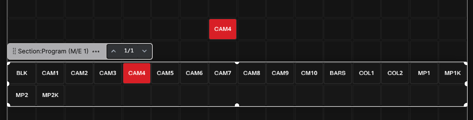

  
Select the **Presets** tab in the right pane of the window. This will present a menu of all connections. **Presets** are pre-configured **Buttons** designed by the module author to simplify the process of creating complete **Buttons**, for easy deployment often pre-configured with both Actions and feedbacks. For example, selecting the S1-Atem1me in the menu provides the options shown below:

  

### The **Settings** Menu  
  

Here, you can customize the style of the preset and add the category as a contextual label for the **Button**. For example:

  

Exploring Other Options: **Popover**, **Section**, and **Button**  

With the **Button** option you can grab one button at the time from the preset pane and drop them in the canvas

  

With the **Section** option, the entire row of buttons is highlighted and can be dragged on to the **Canvas** as a **Section**.

  

Notice the **...** **Button** at the end of the **Section**. This indicates that the section extends beyond the visible **Canvas**. Clicking it reveals additional **Buttons**. After dragging the section onto the **Canvas**, you can edit it as needed. For instance, if you don’t need the *BLK*, *MP1K*, and *MP2K* *Buttons*, you can delete them individually. Be cautious to select the specific **Button**, not the entire section. Alternatively, you can delete buttons via the tree view by *CMD/CTRL + Clicking* their labels to delete them. You can also resize the section as needed.

  

### The **Popover** Option. 
 

The **Popover** section typically contains a single **Button**. Drag it onto the **Canvas** and *push* it to see it in action.

  

The **Popover** **Button** expands and unfolds over other **Buttons** on the **Canvas**, providing a space-efficient way to display less frequently used **Buttons** while keeping them accessible. We will go more in to the details with popover sections in a later chapter.

---

This overview of **Presets** highlights how they can accelerate setup—whether for a small, single **Surface** configuration or a large-scale deployment with multiple rooms and hundreds of **Surfaces**. Keep in mind that not all **Connection modules** include **Presets**, and not all **Actions** are available as **Presets**. If you can’t find a **Preset** that meets your needs, explore the **Actions** in the module. You may still achieve your goal by manually creating the **Button**.