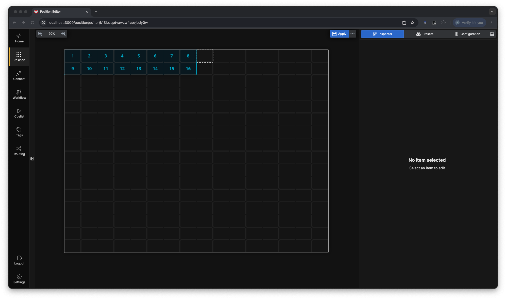

The **Shift Section** effectively doubles the "real estate" available by adding an additional layer of cells, accessible with the press of a single button.

1. **Select the Starting Cell**  
   Click on the cell where you want the shift section to begin.

   

2. **Selecting the desired cells**  
   Click and drag to select all the cells you want to include in the section.

   

3. **Activate the Shift Section**  
   Click on the "Shift Section" button. Or **"Shift" + S**

Now you have created a Shift section

> **TIP**  You can turn off the **Shift** button, and use the internal action *Set Active Page* to navigate between the *Main* and *Shift* page to create your own navigation

### Benefits of a Shift Section

With the Shift Section in place, you now have a button to toggle between the main and shift layers. This is particularly useful for setups like PTZ camera presets, where:

- **Save Functions** can be assigned to the Shift layer.
- **Recall Functions** can remain on the Main layer.

Additionally, if you make the section scrollable, you can fit even more buttons within the same cells on the canvas.

  
