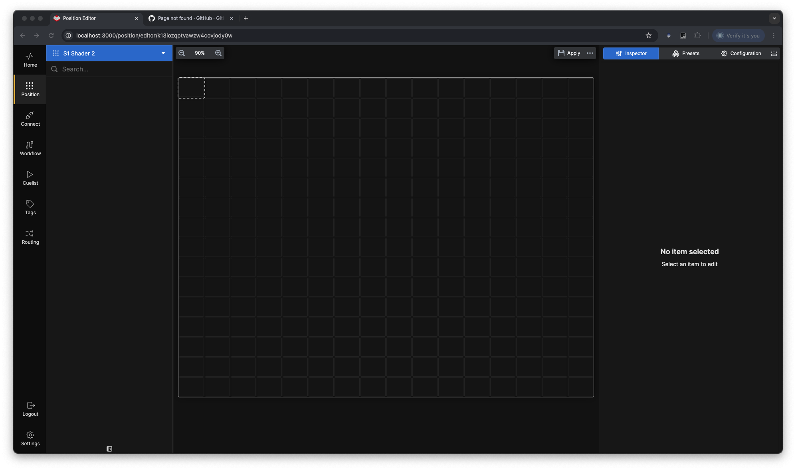
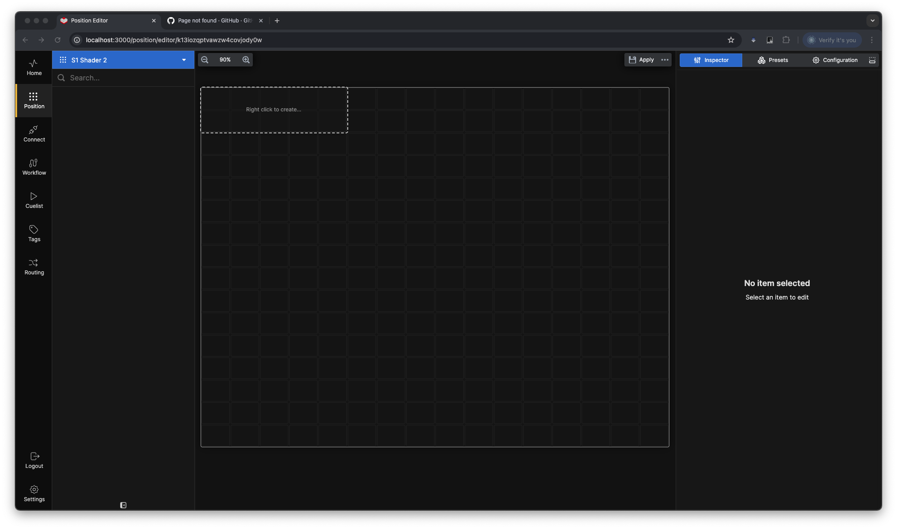
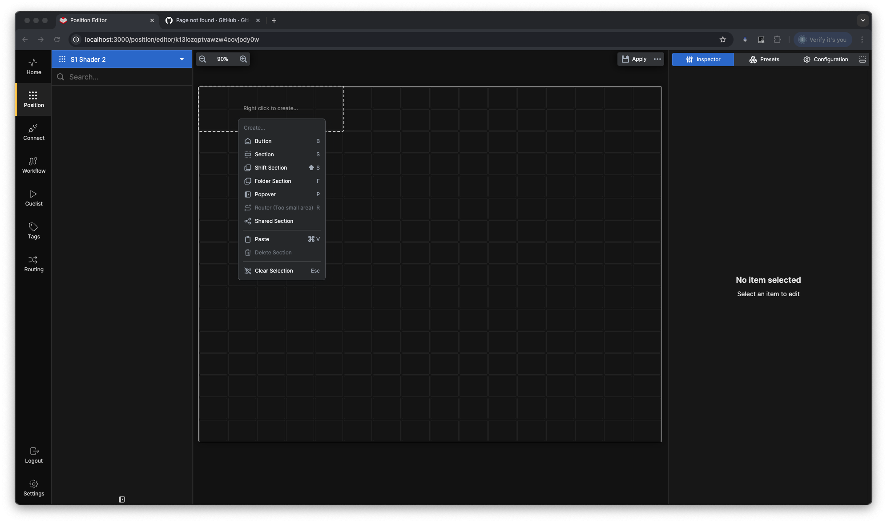
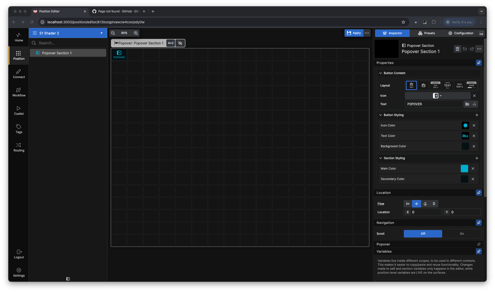
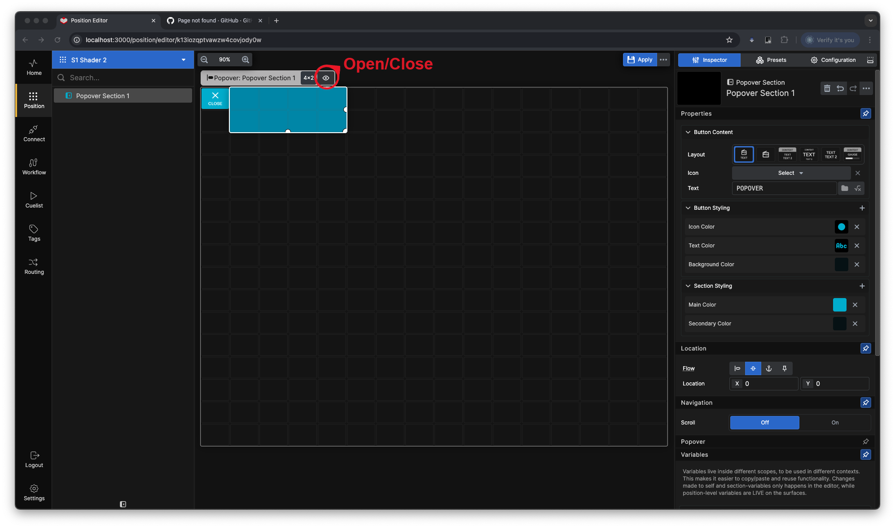
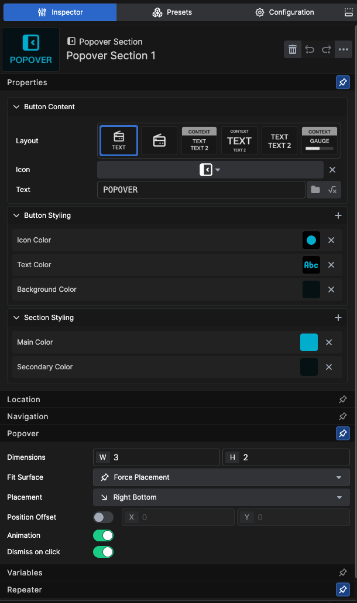

**Popover sections** are special **Sections** that expand out from a single button. These are ideal for functions that you want easily accessible but don't use frequently.

### Steps to Create a Popover

1. **Select Starting Cell**  
   Click on the cell where you want to place your Popover.  
   

2. **Define the Size of the Unfolded Popover**  
   Click and drag to select the cells you want to include in the unfolded Popover.  
   

3. **Convert to Popover Section**  
   Right-click within the selected area and choose **Popover** from the menu.  
   

4. **Popover Creation**  
   The selected cells will now be converted into a Popover. Even though you selected 32 cells, only the starting cell is initially occupied, leaving the remaining 31 cells free for other sections and buttons.  
   

5. **Unfold and Edit the Popover**  
   Click the *Unfold/Foldup* button at the end of the section bar to view and edit the Popover section. You can add buttons or nested sections as needed.  
   

In the Inspector for the Popover, you can customize:  
- **Color and Icon**: Change the appearance of the Popover button.  
- **Section Color**: Adjust the color of the section.  
- **Size and Direction**: Modify the size of the section and the unfolding direction of the Popover.
- **Position Offset**: Offset the section away from the button to any position on the canvas. 
- **Animation**: Turn the open/close animation on or off.
- **Dismiss on click**: Automatically close the Popover section after you push a button inside it.
   
   