The **Router Section** is an automated feature that populates itself with buttons similar to a standard XY router panel, based on the router-compatible connections you have. You can customize the **Router Section** using **Filters** and **Tags** to perfectly match your environment.

---

### Steps to Create a Router Section

1. **Select the Starting Cell**  
   Click on the cell where you want to begin your router section.  
   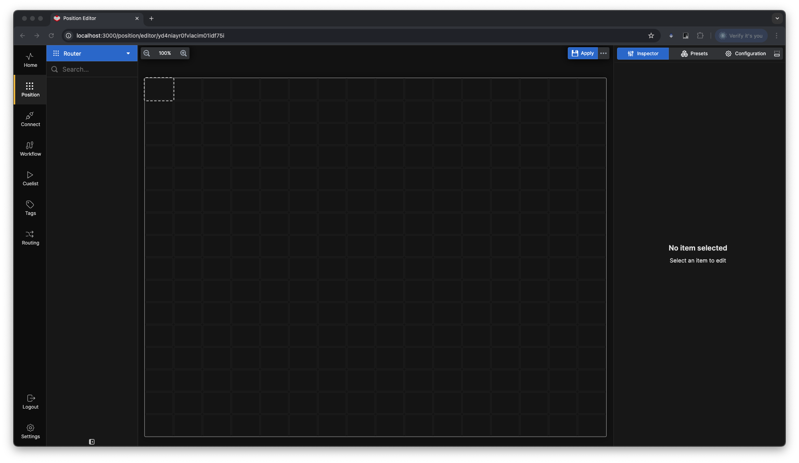

2. **Define the Size of the Router Section**  
   Click and drag to select the cells you want to include in the Router Section. Note that there are minimum size requirements: at least 6x2 cells. However, this size is not very practical as there are six mandatory buttons in a **Router Section**. In this example, we select a 16x2 cell area, which can be resized later if needed.  
   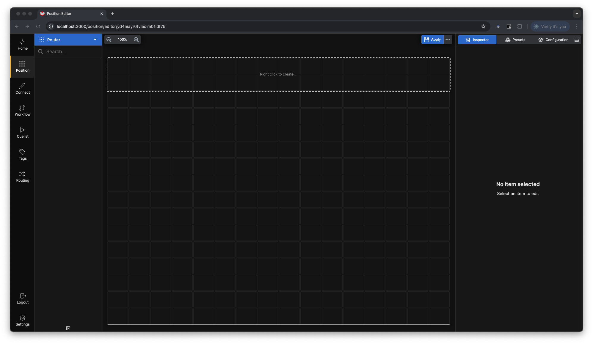

3. **Convert to Router Section**  
   Right-click within the selected area and choose **Router** from the menu. If the selected area is too small, the **Router** option will be greyed out.  
   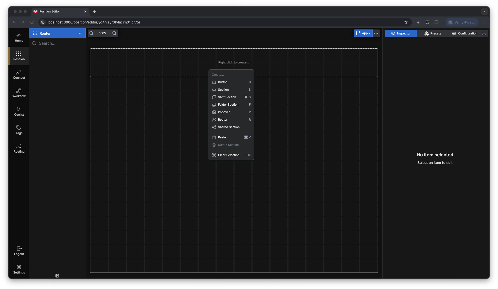  
   

4. **Router Creation**  
   The selected cells will now be converted into a **Router Section**. It will automatically populate with all *Router Enabled* connections, along with Filter, Take, Delete, Auto, and Shuffle buttons.  
   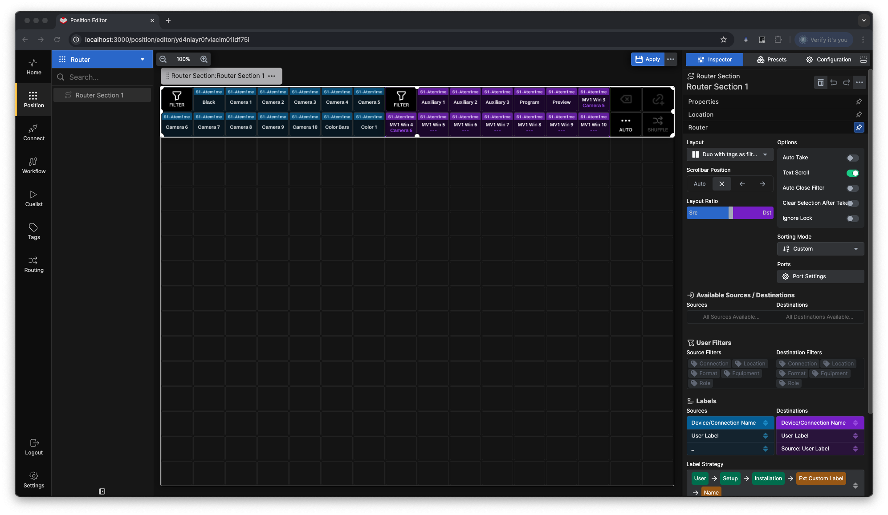

---

### Router Layout Options and Settings

The Router Inspector provides layout options and settings for your Router Section.  
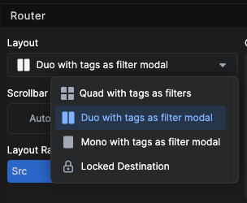

1. **Default Layout (Dual)**  
   This layout features two scrollable blocks for Sources and Destinations, with buttons to access filters in each block.  
   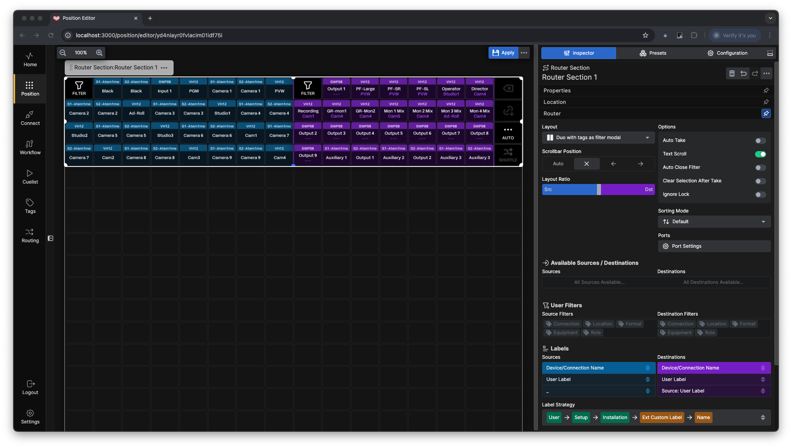

2. **Quad Layout**  
   In this layout, filters occupy two blocks, and Sources and Destinations share the remaining two. This setup is ideal if you frequently use filters and have a large workspace, such as three stacked Stream Deck Studios.  
   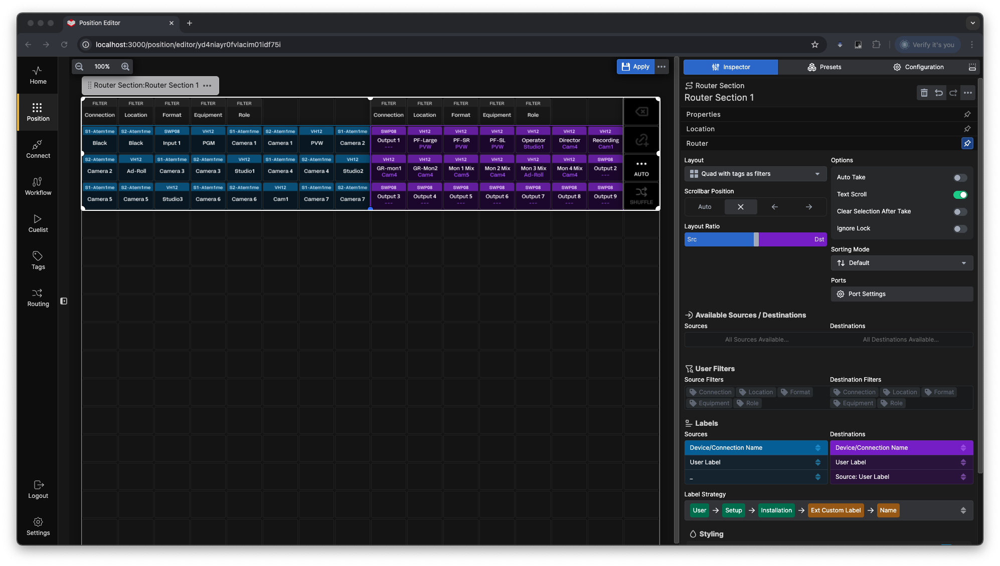

3. **Mono Layout**  
   This layout dedicates most of the button surface to either Destinations or Sources, with a button to toggle between the two.  
   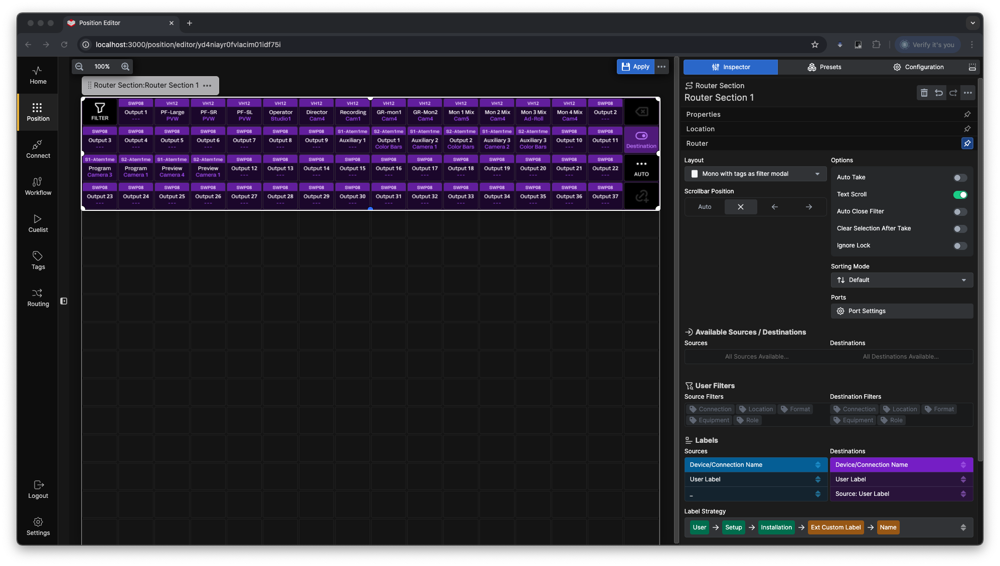
   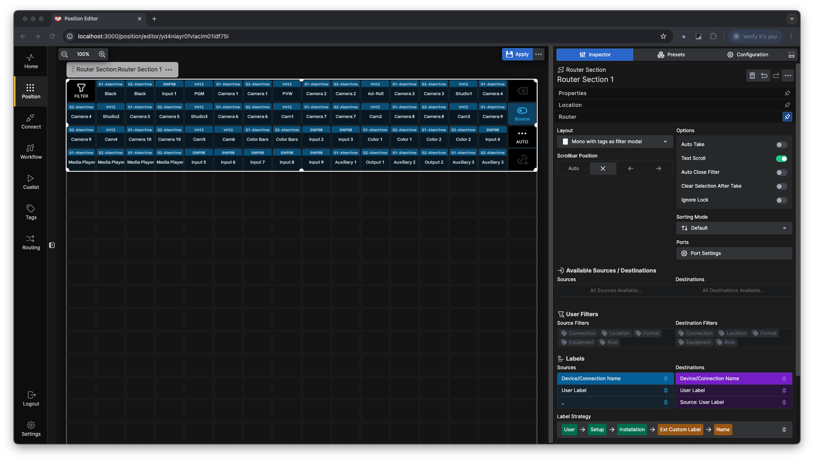
   

---
### Limiting Source and Destination access. 

You can also control which sources and destinations are available for your particular router panel.
   As an example we can use a producer monitor where you want to give the producer access to watch a select set of sources but only be able to change their own monitor alleviating any risk of accidental routing any critical destinations. This is done by using Tags.

Start by adding a tag, in this example we will just put it in the location collection.
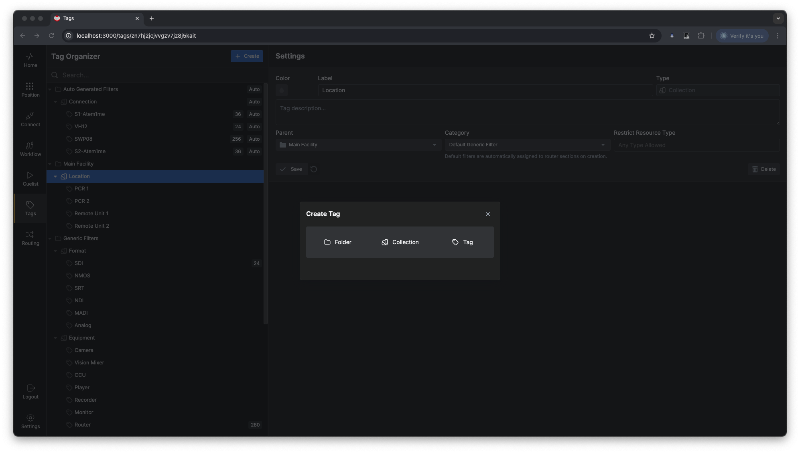
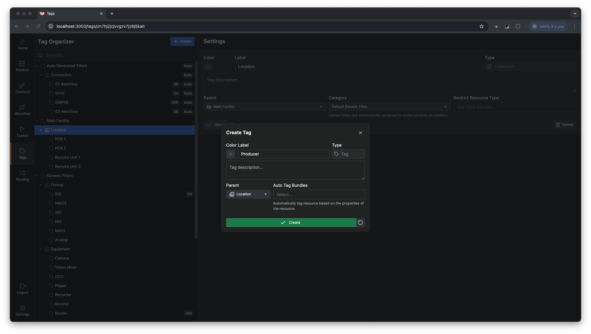

Go in to the Destination bundles and select the output that the Producer monitor is connected to.
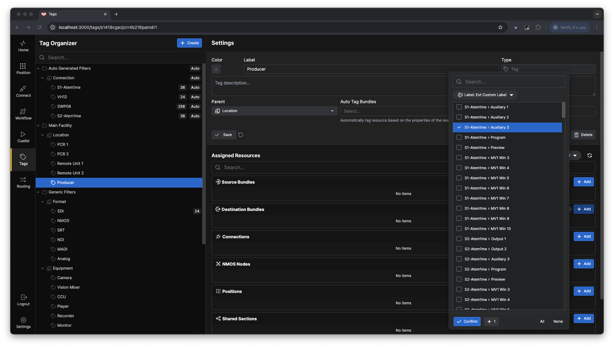

Likewise go in to the Source bundles and select the sources you want the Producer to be able to choose between. 
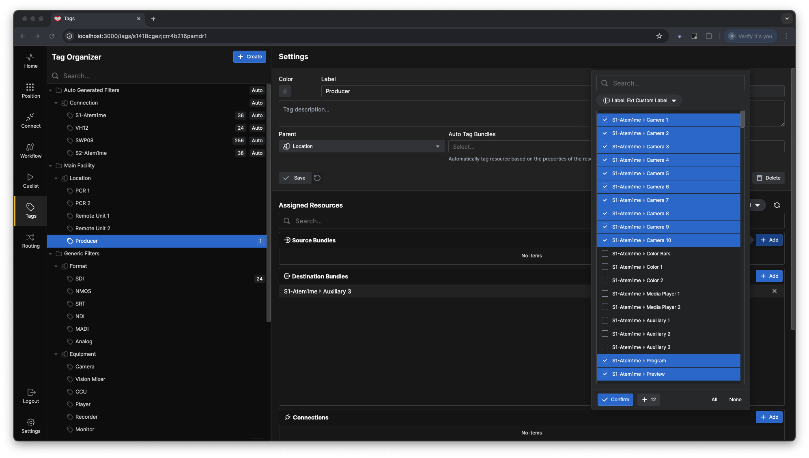

Then go in to the Inspector of the producer router panel, and change the available sources and destinations by clicking in the boxes of either. This will bring up the **Select Tag** dialog, here you select the **Producer** Tag you just created for both Source and Destination. And Click Apply
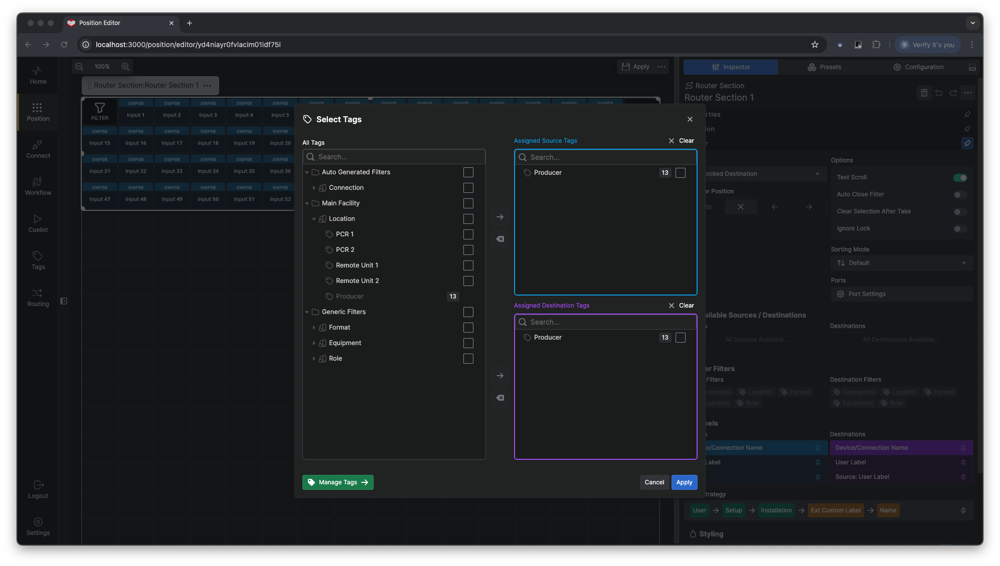
Your router panel will now only show the selected Sources and Destinations.
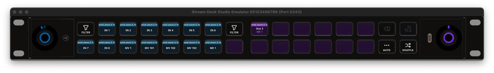

---

### Filtering and Tagging

The Router automatically filters your **Sources** or **Destinations** as you interact with them.  
In the example below, selecting **SDI1** on **NMOS A** as a **Source** filters the **Destinations** to show only the compatible NMOS destinations in our demo setup.  
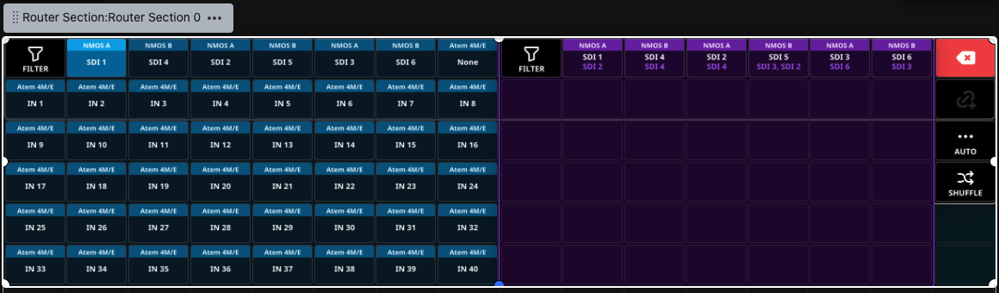

You can refine filtering by using the filter buttons. The filter tags shown are system defaults, but you can add custom tags in the **Tags** Page of Buttons.  
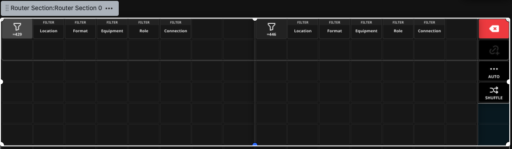

---

### Advanced Routing with Shuffle and Auto

With the **Shuffle** and **Auto** buttons, you can control which components of a source are routed to a destination. Note that not all devices support component splitting; for instance, NMOS devices typically allow this by default, whereas budget routers may not.  
Below is an example of a two-part route:  
- The Video component is routed from **SDI 1 Source**.  
- The Audio and Data components are routed from **SDI 4 Source** to the **SDI 1 Destination**.  
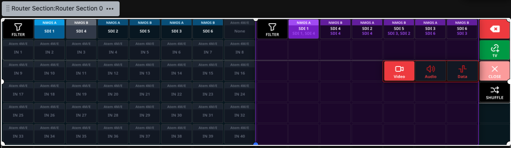  
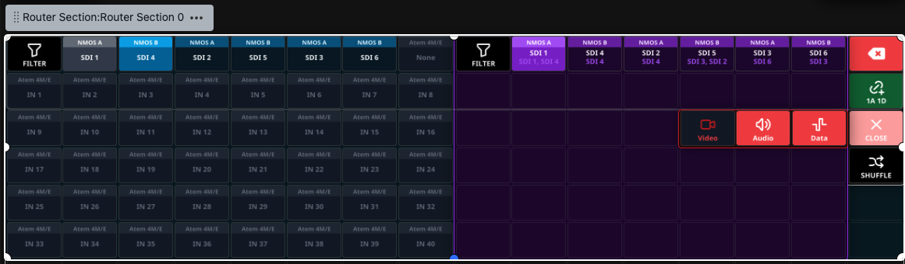

Using the `Shuffle` view, you can achieve an even more detailed view. The example shows a 64ch Madi destination and a 4 ch SDI Input of a Atem 4me Constellation. Buttons give you access to route any of the 4 source Audio channels to any of the Madi destination. You can press the purple `Destination` button to toggle between active sources and destinations.  
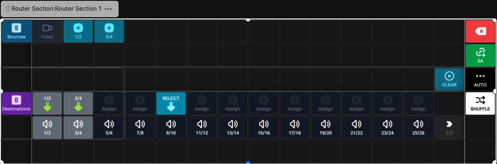

---

### Router Inspector Options

The Router Inspector have a lot of settings, and we will take a look at them below. 

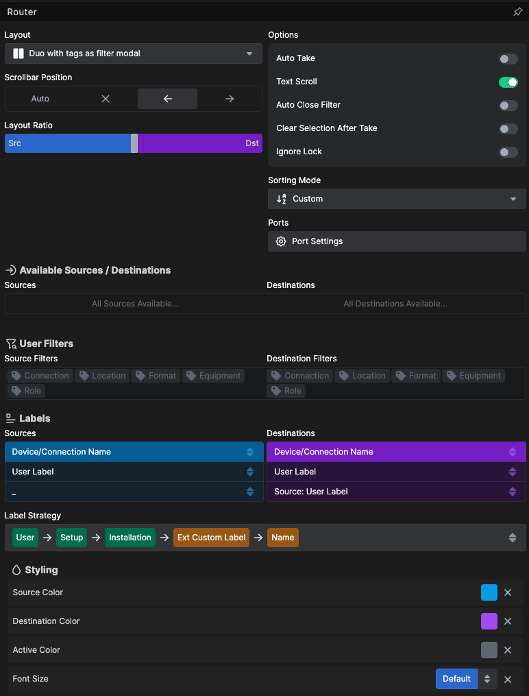

**Layout:**  

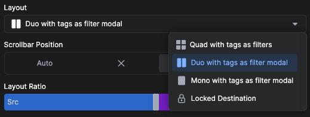

The Layout is described in another part of the Router Section document.  

**Scrollbar Position:**  

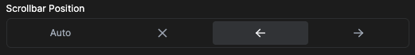  

Here you can determine where the Navigation buttons for the scroll function should be placed, You can also remove them, if your router section is on a surface with encoders.

**Layout Ration:**  

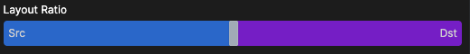

The Layout Ratio lets you move the dividing line between Sources and Destinations. Making room for more sources than destinations, or the other way around depending on your configuration.

**Options:**  

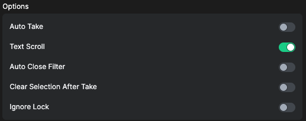 

The options dialog box lets you turn on and off:
- Auto Take: Will automatically take a route when you have selected a destination and source.
- Text Scroll: Will move oversized labels back and forth on the button so that you can read the full label.
- Auto Close Filter: Will close the filter dialogs after you have made a selection.
- Clear Selection After Take: Will clear the selected sources and destinations after you take the route.
- Ignore Lock: Some routers will have a Lock state on destinations that will prevent you from making changes to it, turning on this option will ignore any lock state.
  
**Sorting Mode:**  

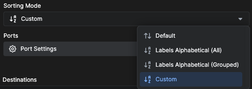  

Determines how the sources and destinations are sorted in the Router Section

- **Default:** 
- **Labels Alphabetical (All):** Will sort the buttons in alphabetical order of the labels set on the buttons.
- **Labels Alphabetical (Grouped):** Will first group the buttons by connection and then sort them alphabetical by the label on the buttons.
- **Custom:** will sort the buttons in accordance with the custom sort column in the Label page of the Routing UI.

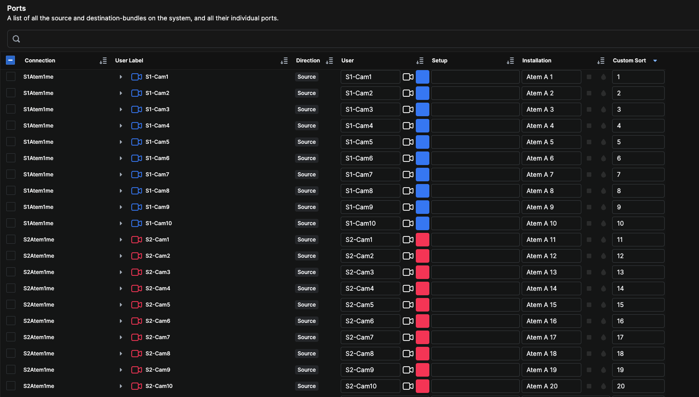
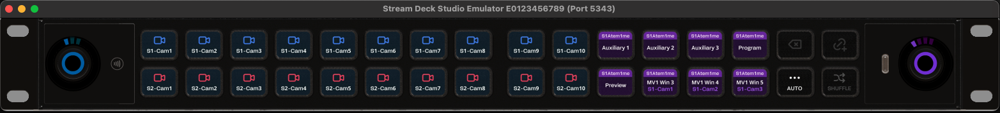

**Ports:**  

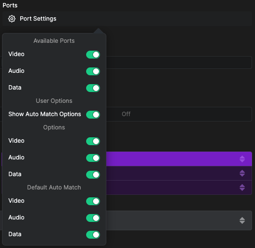  

Gives you options for the **Auto Matching** under the **Auto** button in the Router Section, here you can select which ports that will be available and Matched in the Router Section. If you want to make a Router section that only handles Video, you can turn of the Audio and Data options. If you turn off the "Show Auto Match Options" the **Auto** button itself will be removed from the Router Section. 

**Available Sources/destinations:**  

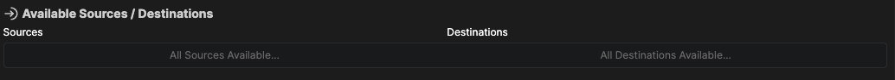  

The Router Section will by default show all available Sources and Destinations in the configurations, by adding **Tags.** In these boxes you can limit which Sources and Destinations are available for the **Router Section.**

**User Filters:**  

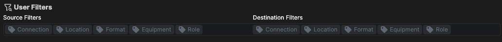  

By Default Buttons will use the Auto Generated filters in every **Router Section.** You can add your own, or remove any of the Auto Generated Filters.  
If you remove all of them, the **Filter Buttons** in the Router Section will also be removed.

**Labels and Label Strategy:**  

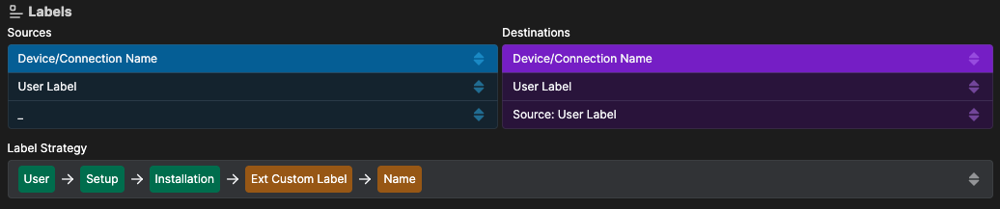  

These two settings needs to be seen in conjunction.
You can choose which Label you want to use on sources and Destinations independently of each other. The **Name** and **Ext Custom label** are fetched from the connections, all connections have a **Name** but not all connections will have an **Ext Custom Label**. The **User**, **Setup** and **Installation.** Labels are user labels created in the Labels section of the Router UI.

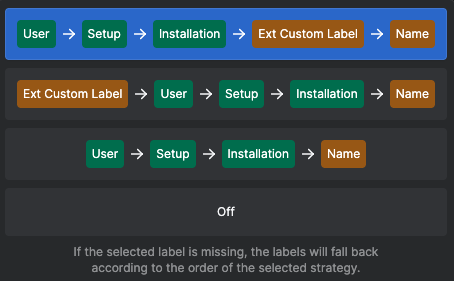  

The **Label Strategy** will fall back from the label you have chosen under **Labels**. Meaning that, if there is no label in the chosen category it will use the next to the Right all the way down to the **Name** Label in accordance with the chosen **Label Strategy**. If you Choose the Off option you must make sure that all ports have a label in the chosen category, or you will end up with buttons without a label. 

**Styling:**  

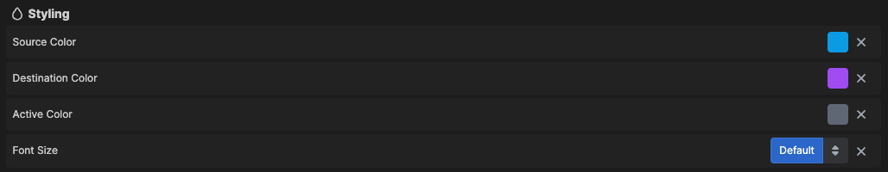
Here you can change the colors for the sources, Destinations and the Active Source. You can also set the **Font Size** for the Source and Destination buttons.

The **Router Section** works closely with the **Routing** and **Tags** pages. Familiarizing yourself with these will unlock the full potential of the Router Section.

---

