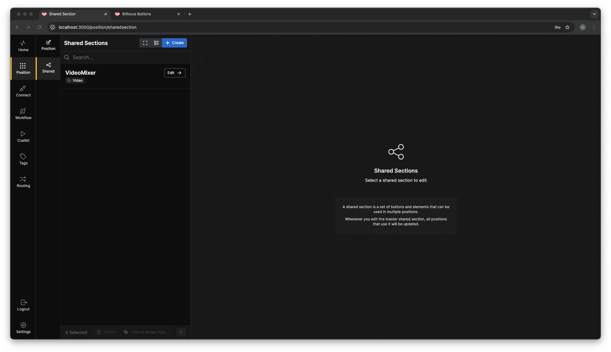
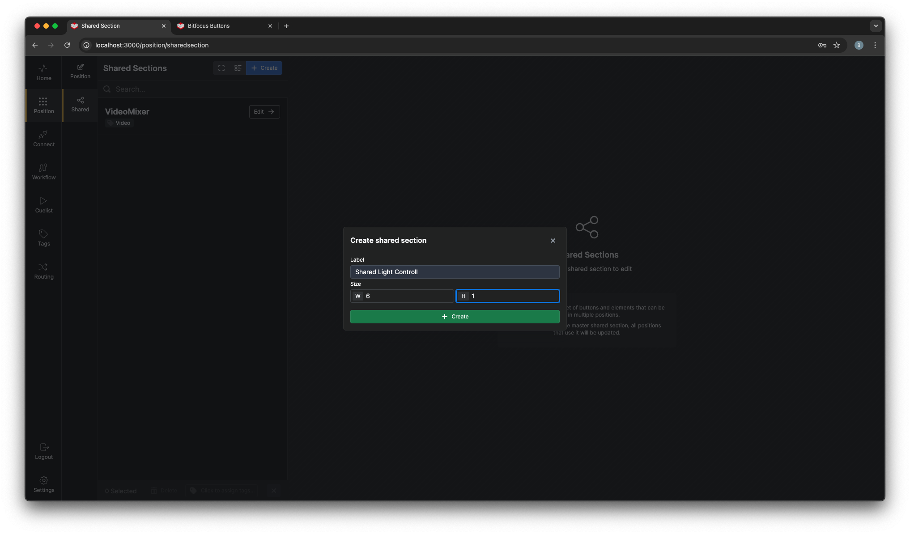
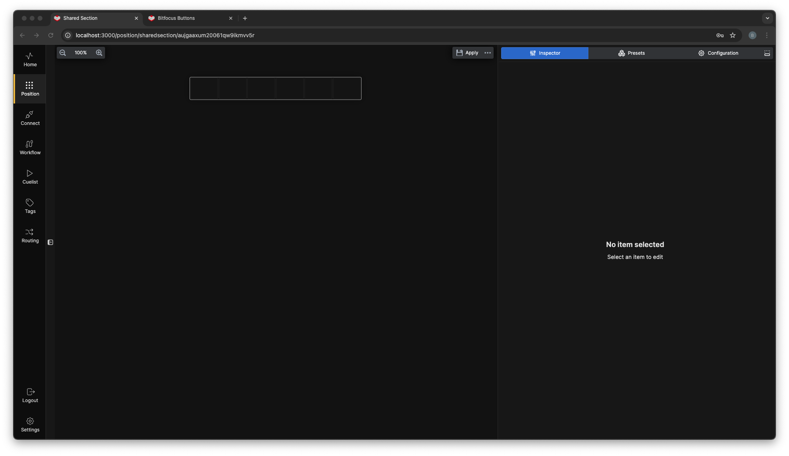
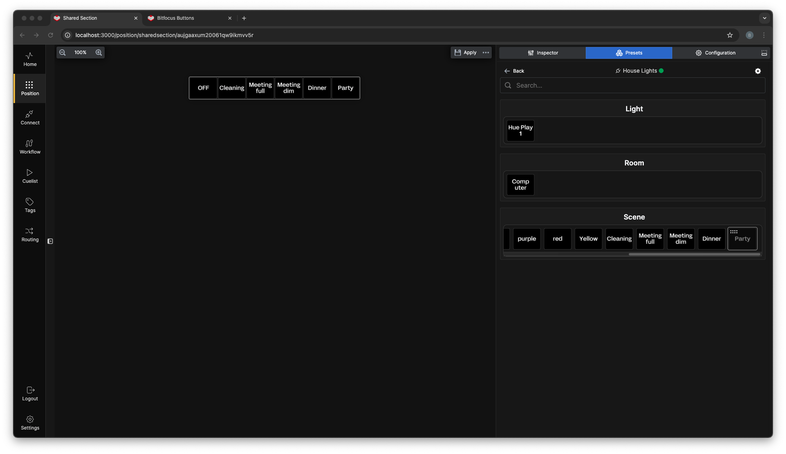
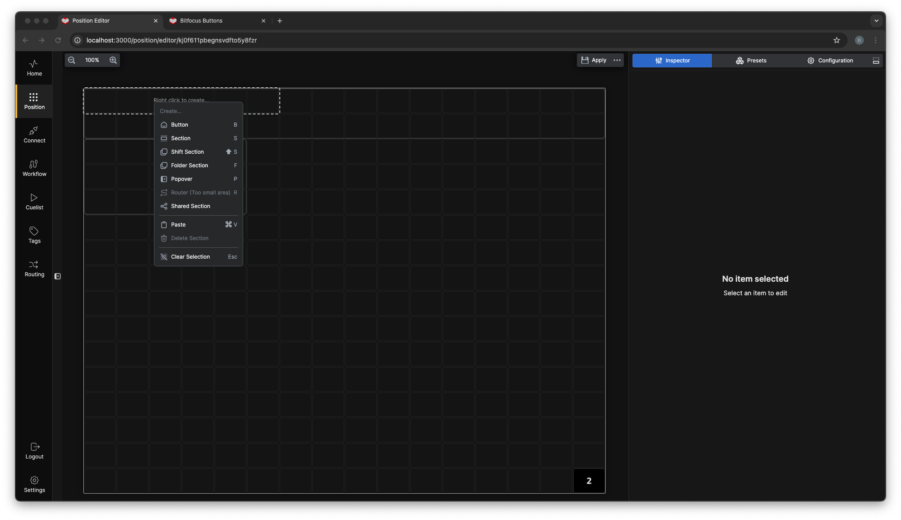
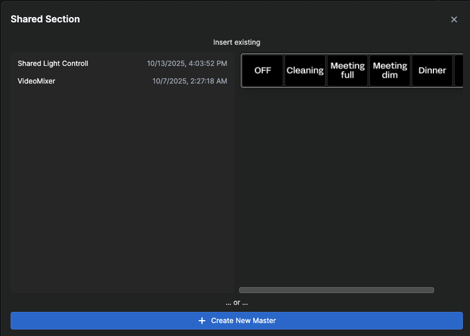
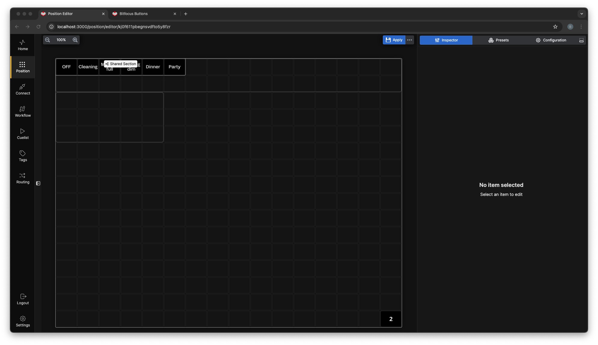
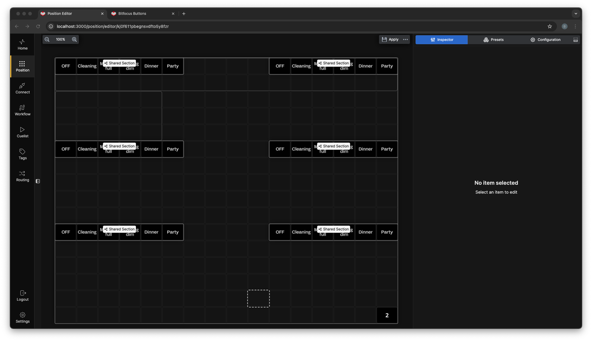
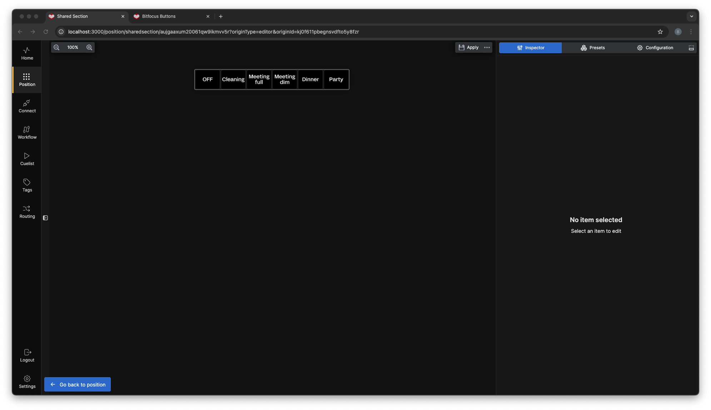

**Shared Section**

The **Shared Section** is a special section that can be embedded in to positions, sharing a common set of buttons. One of the advantages of this is that common buttons can be made once and if they need to be updated, you can change the shared section and every place the shared section is in use will be updated. 

You will find the **Shared Section** under the position.

Click on **+Create** and you will be presented with a dialog box. Enter a name for the Section and, set the size.

You will then get a canvas on the screen with the size you entered in to the dialog box.

You can then add buttons either manually or from presets, here we have added some light scenes from a Hue light.

Go in to a position and select the same number of cells as your **Shared Section** right click inside the selected cells, and select **Shared Section**. 

You will be presented with a dialog box that shows you all the **Shared Sections** In your configuration. Choose the "Shared Light Control" 

This will place the shared section in your Position with all the buttons.

And you can reuse it as many times you want, both in one, and in multiple positions.
If you need to edit the edit the section, you can click on the shared section, witch will bring up the section bar with a button to take you straight to the right shared section.

>**Tip!** When you place a shared section in a Position it will have access to the Position variables of that position.
