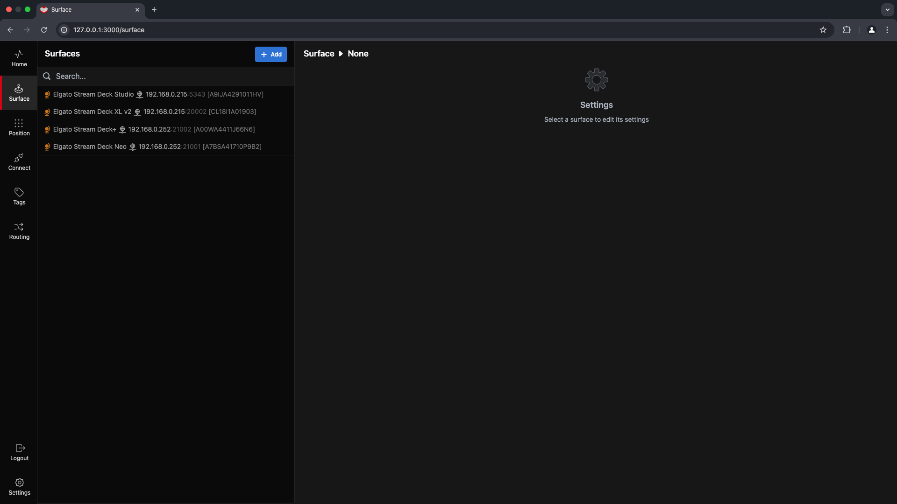
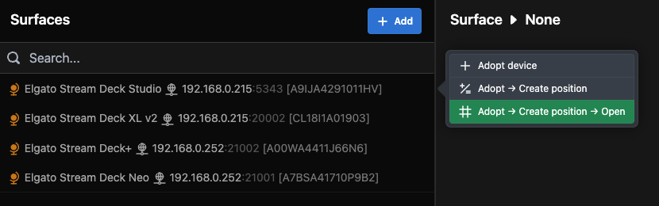
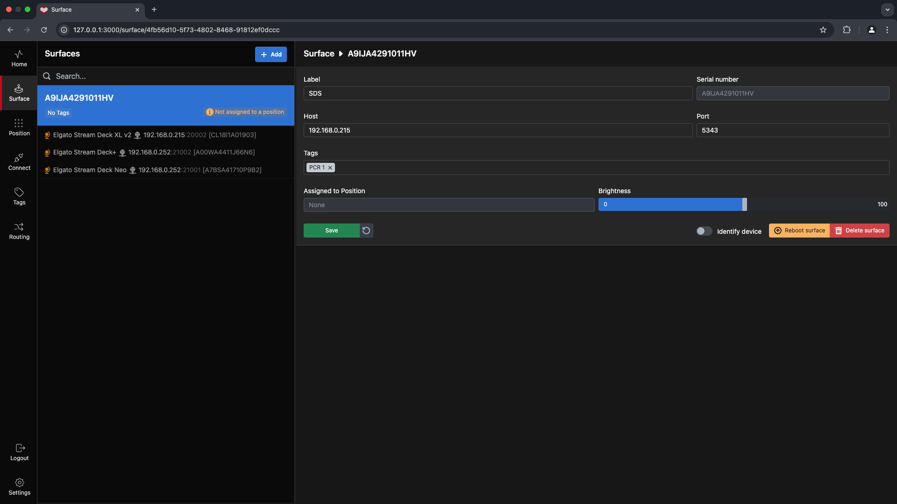
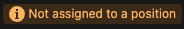
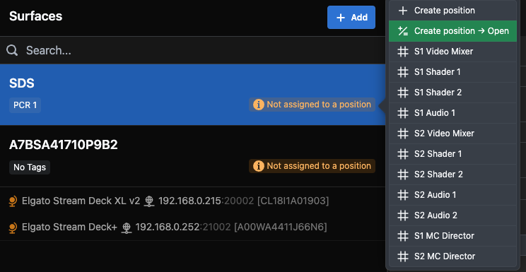
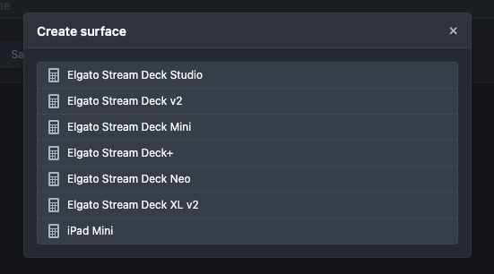
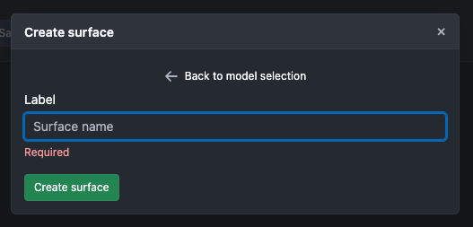
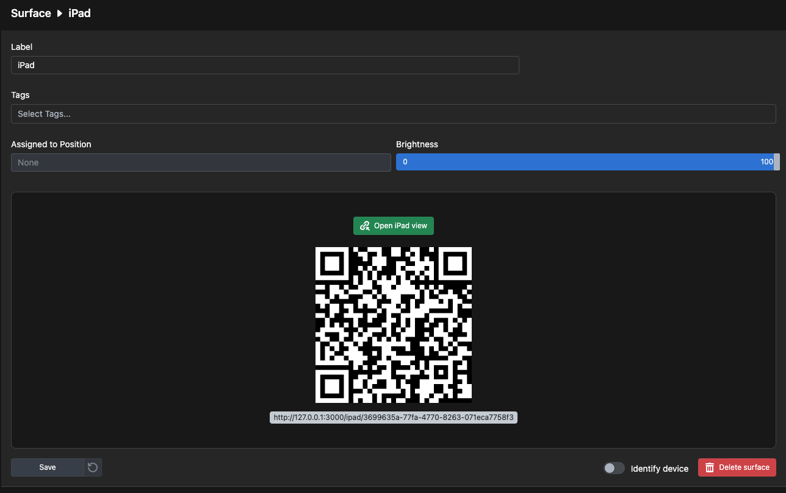
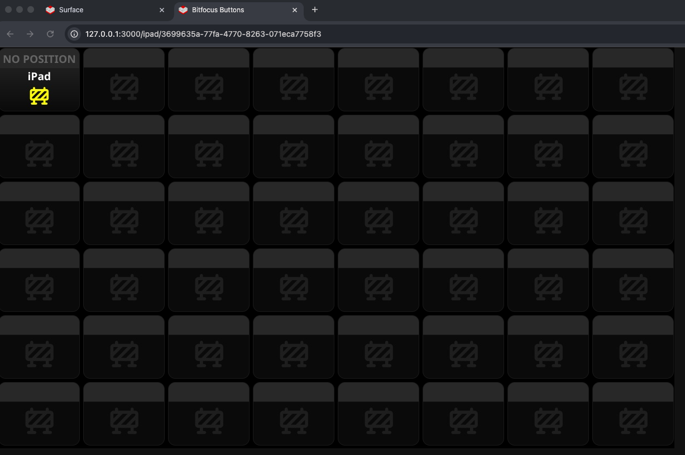

When you click on the **Surface** button in the menu bar, the window shown above opens. Initially, this window displays the surfaces available on the network you are connected to. It provides details about the surface type, IP address, port number, and serial number.

---

If you `click` on one of the surfaces, the context menu shown above will appear. For now, let’s `click` on **Adopt**.

---

`Clicking` **Adopt** adds the surface to **Buttons**. `Click` it again to open the **Surface Config** settings. Here, you can:

- Change the label of the surface.
- Add tags.
- Adjust the panel brightness.
- Reboot the surface.
- Use the **Identify** function to flash a button on the physical surface, making it easier to locate.
- Delete any surfaces you no longer want to control in **Buttons**.

Remember to `click` **Save** when you are done.

---

The  informational indicator by the surface shows that the device is adopted into **Buttons** but is not currently assigned to any **Position**.

---

If you `click` on the indicator, a context menu appears where you can either:

- **Create Position**
- Or, assign the surface to an existing **Position**, depending on your configuration.

In this setup, we already have a few positions configured.

---

You can also `click` on the blue  button to manually set up a surface.

---

This opens the **Create Surface** selection dialog box. Let’s select an iPad.

---

Next, give it a name and `click` **Create Surface**.

---

This brings up the **Surface Config** page for the iPad Surface you just created. To view it, `click` the green  button. This will open an iPad view in your browser, which can be used as a surface.

---

To bring this view to an actual iPad, replace the loopback IP address `127.0.0.1` with the IP address of the machine running **Buttons**. For example:

`http://192.168.0.252:3000/ipad/3699635a-77fa-4770-8263-071eca7758f3`

In this case:
- `192.168.0.252` is the IP address of the machine.
- The final part of the URL (`3699635a-77fa-4770-8263-071eca7758f3`) is the unique ID of the **Surface**.

These values will differ in your setup based on your IP address and surface configuration.