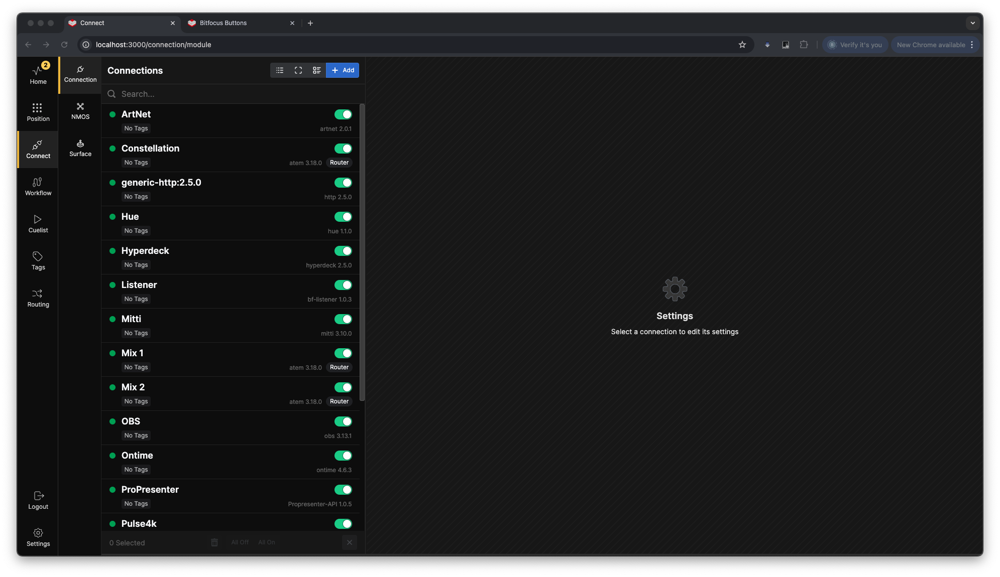

**Connection** is where we link **Buttons** to the outside world: switchers, routers, software, hardware, and other imaginable (and unimaginable) options.  

To start adding **Connection**, click the **+Add** button in the top-right corner of the left pane. This will display an extensive list of possible connections.  

If no connections are visible, or you can't find the right module. You may need to update the library. To do this, click *Download modules* in the top-right corner. 

This will bring up a popup box showing you the modules that are missing from your library or have newer versions.

Ensure you are online, as this process fetches the library from Bitfocus's servers. The download duration depends on your connection speed and the number of modules that will be downloaded.

Once the download is complete, you can search for the desired connection. Search by Manufacturer, product line, or protocol. Generic connections can also be found by searching for the "generic" phrase.  

### Connection Details

Each connection comes with a version dropdown and several informational badges.  

**Router Badge**: Indicates that the connection supports the Router system in Buttons. To filter the connections list for Router-supported options, click *Only Routers* at the top of the list.  

**Legacy Badge**: Indicates that the connection does not adhere to the latest API standards. While it may work, some features might be unavailable or non-functional.  

**Pre-release badge:** Indicates that the developer has released a test version of the module, and it may lack functionality or contain bugs.

**Version Dropdown**: Allows you to select between different versions of the connection as the library evolves.

You can also click the cogwheel to see and download other versions of the module. 

### Adding a Blackmagic Design - ATEM Connection

To add the latest version of the *Blackmagic Design - ATEM* connection, click the **Add** button.

### Configuring Connections

In the right pane of the connection page, you’ll find all configuration options for the selected connection. 

Some connections support MDNS to automatically discover devices, but its good practice to know the connection settings beforehand. You can also enter the IP address for the connection manually. Its good practice to give each connection a clear and descriptive Label and Variable Key, so it's easy to recognize at a later stage.

Under **Module** in the top right corner you can see the current module version in use for this connection, and by clicking on it you can bring up a dialog box allowing you to swap the module versions.

In addition to the Config View, you can also get an overview of the Actions available in the connection

There is also an overview of the available Feedbacks. 

And Variables.

Under Ports & Bundles you will get an overview over what will be added to the Router system in Buttons 

These buttons will allow you to navigate to Github to post a bug report or navigate to the repository. The help button will bring up the help file written by the module author.

The Connection view option buttons 

  
- The first button will turn on the Log view, giving you opportunities to debug the connection.
- The second button will toggle between compact and detailed view
- The third button will allow you to group and sort the connections by tags

Logview.

 

Minimized and Maximized view

Grouping options

We have now had a look at the different options for 1 module, there will be a lot of differences between the modules, but the main functionality will be the same. Take some time to familiarize yourself with the different options for the modules you will be using.

