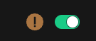

**This Document is outdated and will be updated shortly.**

**Connect** is where we link **Buttons** to the outside world: switchers, routers, software, hardware, and other imaginable (and unimaginable) options.  

### Adding Connections

To start adding `Connections`, click the `+Create` button in the top-right corner of the left pane. This will display an extensive list of possible connections.  

If no connections are visible, you may need to update the library. To do this, click `Refresh module versions` in the top-right corner of the right pane. Ensure you are online, as this process fetches the library from Bitfocus's servers. The download duration depends on your connection speed.  

Once the download is complete, you can search for the desired connection. Search by Manufacturer, product line, or protocol. Generic connections can also be found by searching for the "generic" phrase.  

### Connection Details

Each connection comes with a version dropdown and several informational badges.  

**Router Badge**: Indicates that the connection supports the Router system in Buttons. To filter the connections list for Router-supported options, click `Only Routers` at the top of the list.  

**Legacy Badge**: Indicates that the connection does not adhere to the latest API standards. While it may work, some features might be unavailable or non-functional.  

**Version Dropdown**: Allows you to select between different versions of the connection as the library evolves.

### Adding a Blackmagic Design - ATEM Connection

To add the latest version of the `Blackmagic Design - ATEM` connection, click the `Add` button beside the version dropdown.

Upon adding, a warning badge might appear. This indicates the connection is not fully configured yet (e.g., the IP address is missing) or there’s an issue such as a power or network problem.  

### Configuring Connections

In the right pane of the connection page, you’ll find all configuration options for the selected connection. The most crucial step is entering the IP address. Some connections support MDNS to automatically discover devices, but it’s good practice to know the connection settings beforehand.

For Router-compatible connections, you'll have common configurations to select inputs and outputs for the router function. Additionally, you can access helpful information provided by the connection author via the `Question mark` icon in the top-right corner.  

Once configured, the top row will indicate "connected," and the warning badge will disappear. Expandable options at the bottom of the screen display available *Router sources and destinations*, *Variables* and *Actions* for the module.  
  

You are now ready to use the new connection in a position setup.

---

### NMOS

Under the **NMOS** section in the left pane of the connection page, you can find and set up NMOS devices available on your network.  

If NMOS devices on your network announce themselves, they will appear and be available to connect to Buttons. If they are on another network segment or fail to appear, you can manually create the connection by clicking the `+Manual create` button. You’ll need the IP address and Port of the device.  

Provide a Name, IP address, and Port number. For instance, a Blackmagic Design 2110 IP Video Converter 3x3G with IP `10.141.20.1` and port `8090`.  

The NMOS connection is now ready for use in Buttons and will be available in the `Router Section` and on the `Routing Page`.