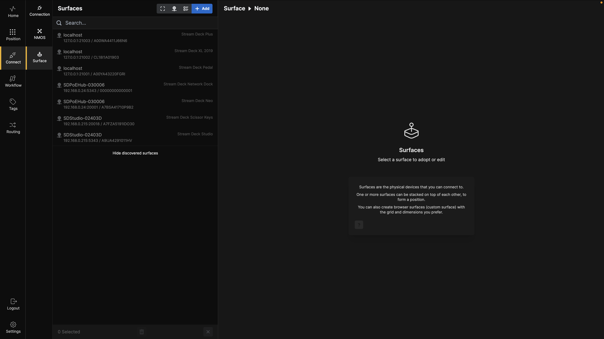
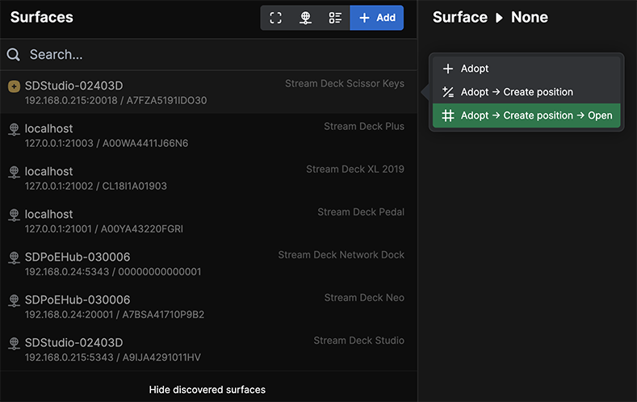
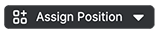
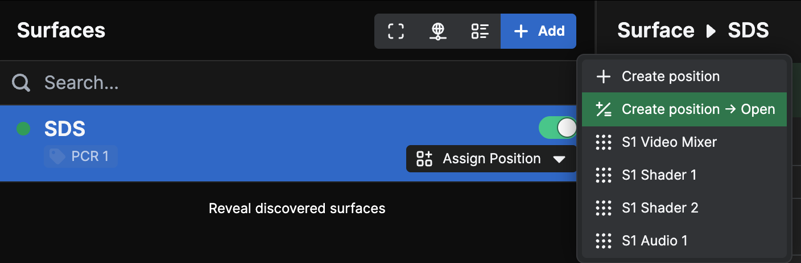
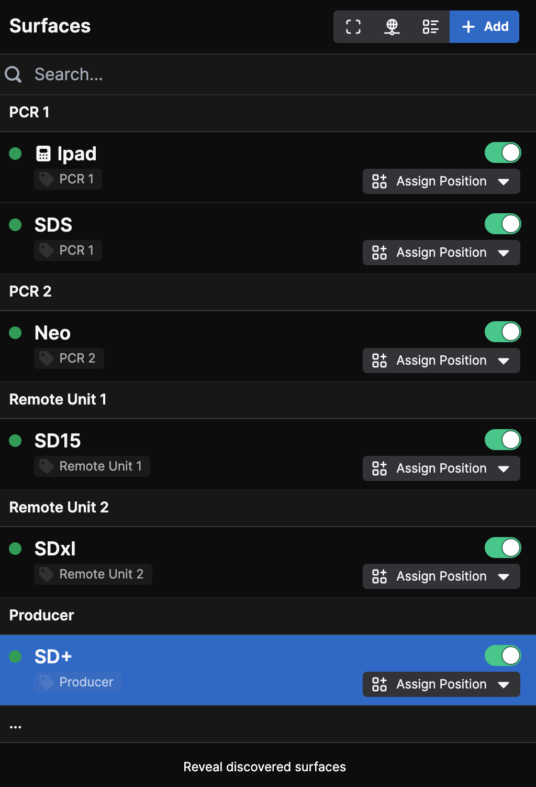

When you click on **Connect** and then **Surface** button in the menu bar, the window shown above opens. Initially, this window displays the surfaces available on the network you are connected to. It provides details about the surface type, IP address, port number, and serial number.

---

If you `click` on one of the surfaces, the context menu shown above will appear. For now, let’s `click` on **Adopt**.

You should also notice the small +Badge in front of the first surface, indicating that the surface is newly been discovered on the network.

---

`Clicking` **Adopt** adds the surface to **Buttons**. `Click` it again to open the **Surface Config** settings. Here, you can:

- Change the label of the surface.
- Reset the Serial Number of the Stream Deck.
- Change the IP and Port of the surface.
- Add tags.
- Assign or remove the surface on a position.
- Check Type of surface and Firmware version.
- Adjust the panel brightness.
- Reboot the surface.
- Use the **Identify** function to flash a button on the physical surface, making it easier to locate.
- Adjust the Viewing Angle of the Stream Deck Studio
- Delete any surfaces you no longer want to control in **Buttons**.

Remember to `click` **Save** when you are done.

---

The  informational indicator by the surface shows that the device is adopted into **Buttons** but is not currently assigned to any **Position**.

---

If you `click` on the indicator, a context menu appears where you can either:

- **Create Position**
- Or, assign the surface to an existing **Position**, depending on your configuration.

In this setup, we already have a few positions configured.

At the top of the window there are a few buttons.

The first button will Minimize/Maximize the information in the surface list, giving you more detail or more space.

The second button will alternate between IP adress and Name for the surfaces.

And the Third button gives you options to group surfaces by tags, making it easyier to organize large systems.

---

You can also `click` on the blue  button to manually set up a surface.

---

This opens the **Create Surface** selection dialog box. Let’s select an iPad.

---

Next, give it a name and `click` **Create Surface**.

---

This brings up the **Surface Config** page for the iPad Surface you just created. To view it, `click` the green  button. This will open an iPad view in your browser, which can be used as a surface.

---

To bring this view to an actual iPad, replace the `localhost` with the IP address of the machine running **Buttons**. For example:

`http://192.168.0.252:3000/ipad/k4tbgtkp3adqhtapemw6npos`

In this case:
- `192.168.0.252` is the IP address of the machine.
- The final part of the URL (`k4tbgtkp3adqhtapemw6npos`) is the unique ID of the **Surface**.

These values will differ in your setup based on your IP address and surface configuration.

___

We can also add a custom surface which will turn any touch-screen with a compatible browser inn to a Buttons surface.

Notice that the config gives you the resolution at the bottom so that you can experiment your way with the different values to perfectly fit the intended surface.

The way to connect a custom surface to the buttons setup is the same as for an iPad. You can also edit the setup after it's created in the config window.

