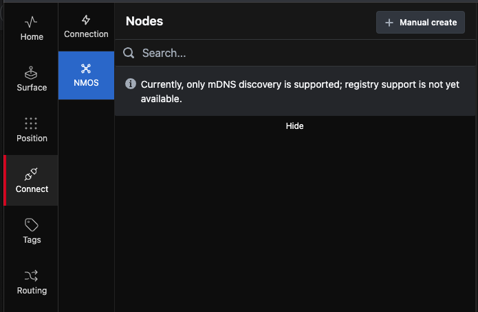
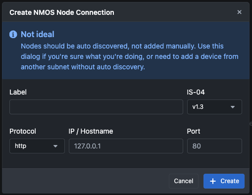

---

### NMOS

Under the **NMOS** section in the left pane of the connection page, you can find and set up NMOS devices available on your network.  

If NMOS devices on your network announce themselves, they will appear and be available to connect to Buttons. If they are on another network segment or fail to appear, you can manually create the connection by clicking the `+Manual create` button. You’ll need the IP address and Port of the device.  

Provide a Name, IP address, and Port number. For instance, a Blackmagic Design 2110 IP Video Converter 3x3G with IP `10.141.20.1` and port `8090`.  

The NMOS connection is now ready for use in Buttons and will be available in the `Router Section` and on the `Routing Page`.