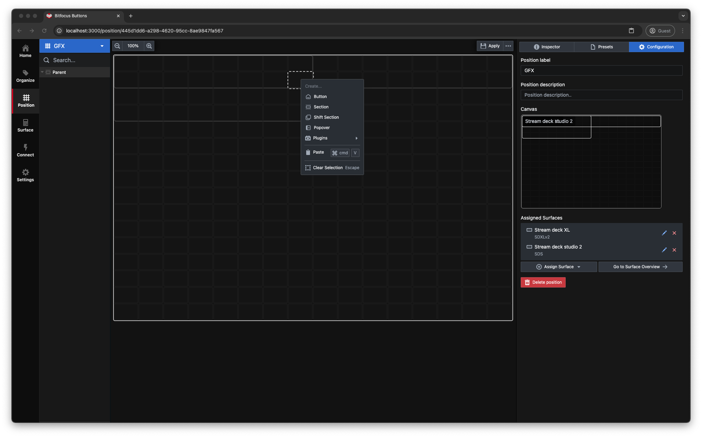

# Position

Position is how we define a collection of one or multiple surfaces, It also typically aligns with the working position of a person for example Vision Mixer, Graphics or Shader. Each position may be Tag'ed for better Organization. You can create a new position by pressing the (+create) in the top of the left pane
You will then be presented with a dialog box to enter a label for the position. Some planing regarding naming conventions is smart so that the system will be logical and consistent.

Click Create position, and the position editor window will open.

The position editor window has 3 panes the left which is the Navigation tree, the middle which is a 16x16 button grid by default and the right which contains Inspector, Presets and Configuration tabs.

The inspector will show the grid size of 16W and 16H let's leave it at that for now, but it can be changed at any time.

`Click` inside any rectangle, the outline will be dashed to show that it's selected. Now you can `Right click` to bring up the context menu from here you can create a **Button**, **Section**, **Shift Section**, **Popover** and **Plugins** Paste and Clear Selection are self-explanatory, but we will go through the rest.

`Click`on **Button**

You have now created a **Button**