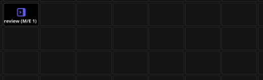
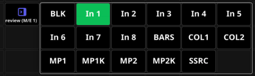

# Presets

Select the `Presets` tab in the right pane of the window, and you will be presented with a menu of any connections you have that has `Presets` in the module. `Presets` are pre-made `Buttons` that the author of the module has included to make adding complete `Buttons` faster and easier. If we select the Atem Extreme 1 in the menu we will be presented with the options below.

The colors shown here are actual `Feedback` colors, so they reflect the status of the connected Atem in this case. If we grab the red *Program(M/E 1)* `Button` and drag it on to the `Canvas`. We have essentially created the same `Button` as in the last section with one "drag and drop"

Notice that there are a few options above the `Buttons`.

We can start with the **...** menu

Here you can change the style of the preset and add the category as a context label for the button.
Something like this.

Now let's take a look at the other options `Popover`, `Section` and `Button`. `Button` is the one we have been using so far, now let's look at `Section`

When you try to grab it you will notice that the whole row gets selected, and that you can pull all buttons on to the canvas at the same time.

Notice the **...** `Button` on the end of the `Section` it indicates that the section extends beyond the `Canvas`and you can push that button to reveal the remaining `Buttons`
You can edit the section freely after you have dragged it on to the Canvas let say we don't need the *BLK*, *MP1K* and *MP2K* `Buttons`. Just select them one by one and delete them, be careful that you actually select the `Button` and not the whole section.

Now let's have a look at the last option `Popover`

You will notice that there's only one `Button`here, let's drag it on to the `Canvas` and push it.

The `Popover` `Button` will expand and unfold over other `Buttons` on the `Canvas`leaving you room to show and hide `Buttons` that are not frequently used, but still keep them accessible.
 
This was a quick overview over `Presets` and how it can speed up your setup, whether it's a small single `Surface` setup or a large setup with hundreds of `Surfaces` spread over multiple rooms and functions. Not all `Connection modules` have `Presets` and not all `Actions` is made in to a `Preset`. If you can't find a `Preset` that suits your needs, have a look at the available `Actions` in the module maybe you still can achieve what you are trying to accomplish by making the `Button` manually. 