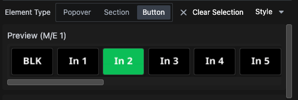
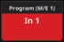
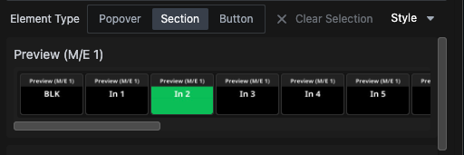

  
Select the **Presets** tab in the right pane of the window. This will present a menu of all connections that include **Presets** in their modules. **Presets** are pre-configured **Buttons** designed by the module author to simplify the process of creating complete **Buttons**. For example, selecting the Atem Extreme in the menu provides the options shown below:

  

At the top, you'll see an option to preview feedback colors. These colors reflect the actual **Feedback** status of the connected Atem (in this case). By dragging the red *Program (M/E 1)* **Button** onto the **Canvas**, you effectively recreate the same **Button** from the previous section with a simple drag-and-drop action.

  

Above the **Buttons**, you'll notice several additional options:

  

### The **Style** Menu  
  

Here, you can customize the style of the preset and add a category as a contextual label for the **Button**. For example:

  

### Exploring Other Options: **Popover**, **Section**, and **Button**  
Thus far, we've been working with the **Button** option. Now let's take a look at **Section**:

  

When you select and drag a **Section**, the entire row of buttons is highlighted and can be moved to the **Canvas** as a group.

  

Notice the **...** **Button** at the end of the **Section**. This indicates that the section extends beyond the visible **Canvas**. Clicking it reveals additional **Buttons**. After dragging the section onto the **Canvas**, you can edit it as needed. For instance, if you don’t need the *BLK*, *MP1K*, and *MP2K* *Buttons*, you can delete them individually. Be cautious to select the specific **Button**, not the entire section. Alternatively, you can delete buttons via the tree view by *CMD/CTRL + Clicking* their labels, then *Right-Clicking* to open the context menu.

  

### The **Popover** Option  
  

The **Popover** section typically contains a single **Button**. Drag it onto the **Canvas** and *push* it to see it in action.

  

The **Popover** **Button** expands and unfolds over other **Buttons** on the **Canvas**, providing a space-efficient way to display less frequently used **Buttons** while keeping them accessible.

   

---

This overview of **Presets** highlights how they can accelerate setup—whether for a small, single **Surface** configuration or a large-scale deployment with multiple rooms and hundreds of **Surfaces**. Keep in mind that not all **Connection modules** include **Presets**, and not all **Actions** are available as **Presets**. If you can’t find a **Preset** that meets your needs, explore the **Actions** in the module. You may still achieve your goal by manually creating the **Button**.