The canvas can be divided into different sections that can be resized and moved as needed. To create a basic section, follow these steps:

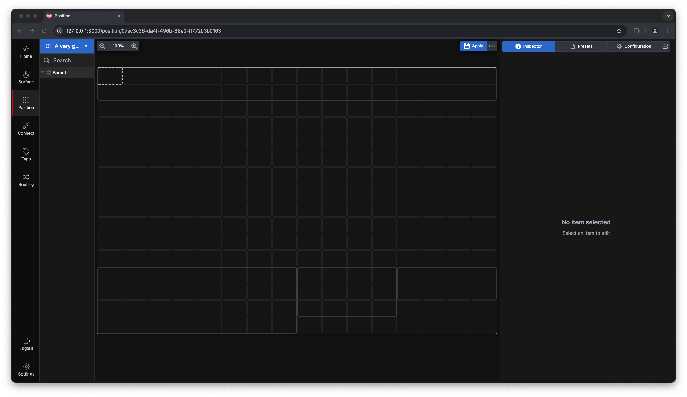  
1. **Start a Section:** Click on the cell where you want to begin your section. A bounding box will appear around the selected cell.

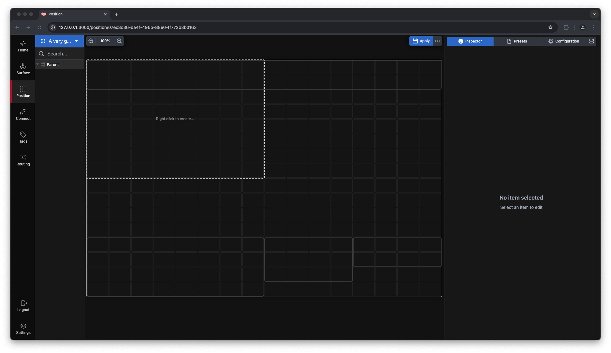  
2. **Expand the Section:** Click and drag to include the desired cells in your section. When you release the mouse button, the bounding box will expand to encompass all selected cells. The text **“Right-click to create…”** will appear inside the bounding box.

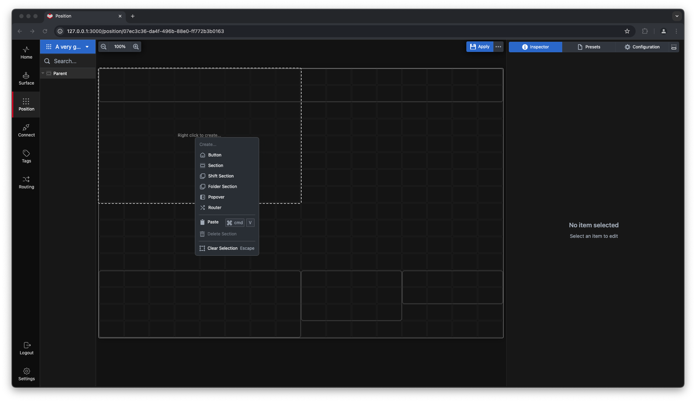  
3. **Create the Section:** Right-click to open the context menu and select **“Create Section”**. This action converts the selected cells into a section with its own bounding box.

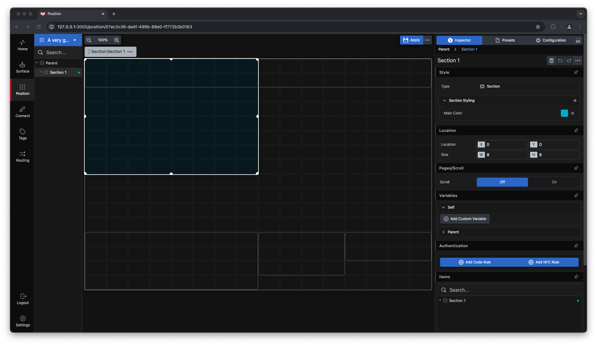  
The section will include handles that allow you to adjust its size and shape. Additionally, a **section marker box** will appear in the top-left corner of the section. You can use the handlebar within the section marker box to move the entire section across the canvas. Simply click, hold, and drag the handlebar to the desired position.

---

### Section Inspector

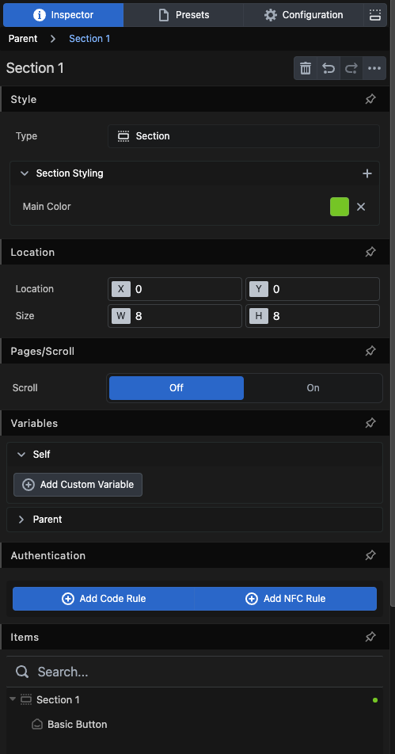  
Let’s take a closer look at the **Inspector** for the section:

- **Style:** Set the main and secondary colors for the section. The color scheme distinguishes this section from others, improving navigation.  
- **Location:** Adjust the position and size of the entire section.  
- **Pages/Scroll:** Define the behavior of the section when it becomes "overfilled."  

---

### Handling Overfilled Sections

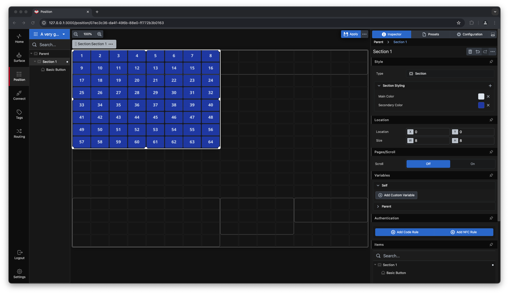  
Here, we have a section with 64 buttons. If we change the section size to **8x2**, it will look like this:

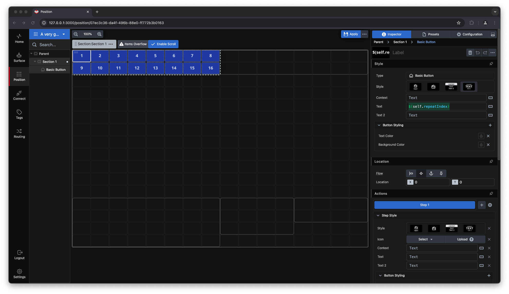  
You will notice a warning about **"Item Overflow"** in the section, along with an option to **“Enable Scroll.”**

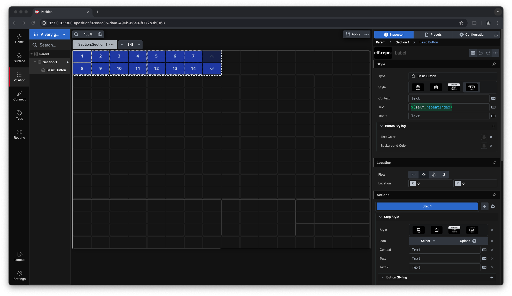  
When you enable the scroll function, navigation buttons appear within the section. If you’re using a **Stream Deck Studio**, you can also use the encoders to scroll through the buttons.  

In the **Pages/Scroll** section of the Inspector, you can configure:  
- The position and visibility of the navigation buttons.  

To switch control between sections, push the encoder. The connected section will briefly flash, and the encoder’s color will change to match the **main color** of the section.  

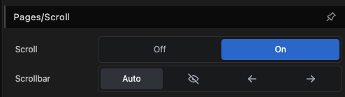  

This feature is a convenient way to expand the available button capacity. For example, when using the **Preset** function for PTZ cameras, which often have 100 or more presets, you can access them efficiently without needing them all displayed simultaneously.

---

### Authentication for Sections

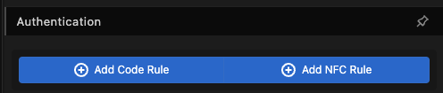  
Sometimes it’s necessary to protect buttons from accidental activation or unauthorized access. Sections can be secured using a **Numerical Code** or an **NFC key fob** (if you use the Stream Deck Studio).  

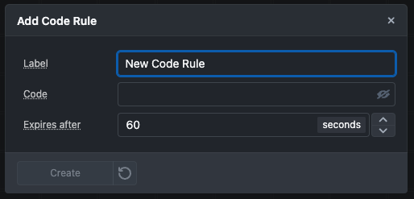  
You can add multiple **code rules** to a section based on your needs. Codes must be numerical, and you can also set a time limit for the section to auto-lock after being unlocked.

When a section is locked, it looks like this. Pressing a button within the locked section brings up the code panel.

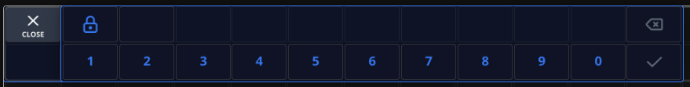  
A **numerical panel** will appear, allowing you to enter your code to unlock the section.

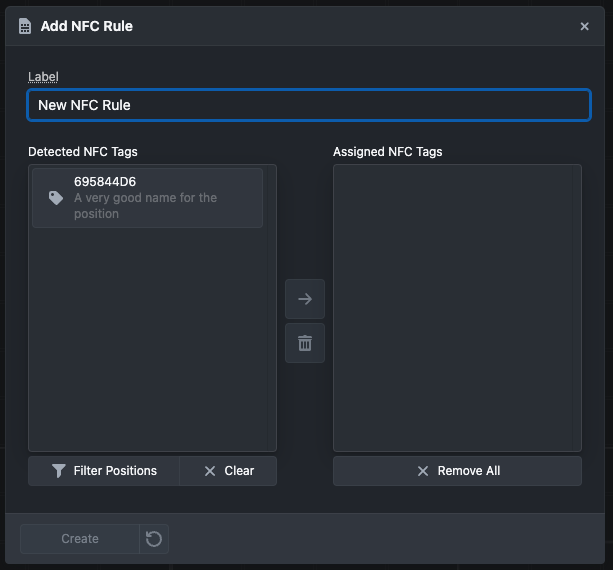  
To use NFC security, select **“Add NFC Rule.”** A window will appear. Hold an NFC key fob, sticker, or another compatible NFC device near the Stream Deck Studio reader. It will be detected and added as a locking/unlocking method. You can add multiple NFC devices to your system.

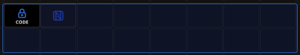  
When both a **Code Rule** and an **NFC Rule** are active, the section will look like this. To unlock the section using NFC, simply hold the NFC device near the reader.

---
