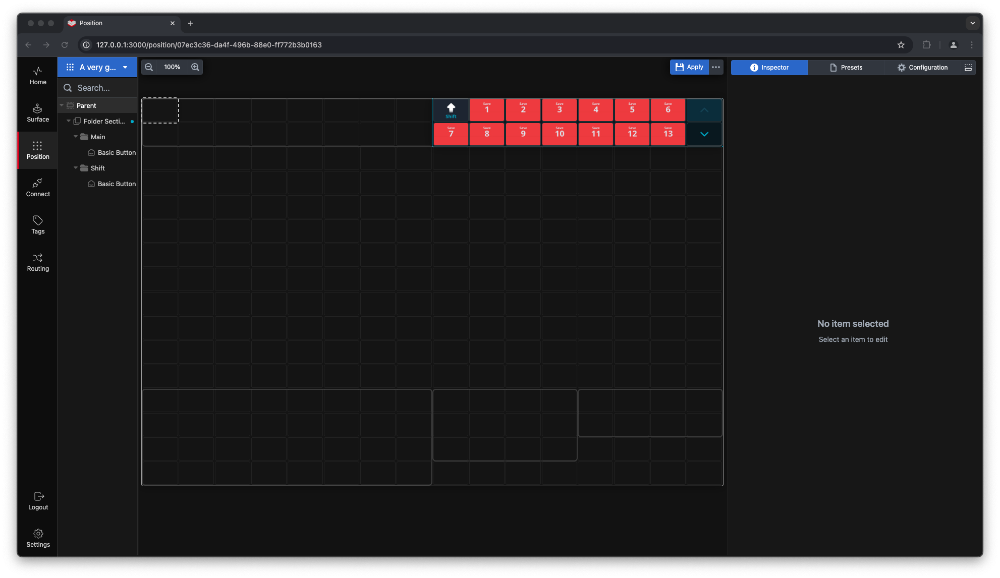
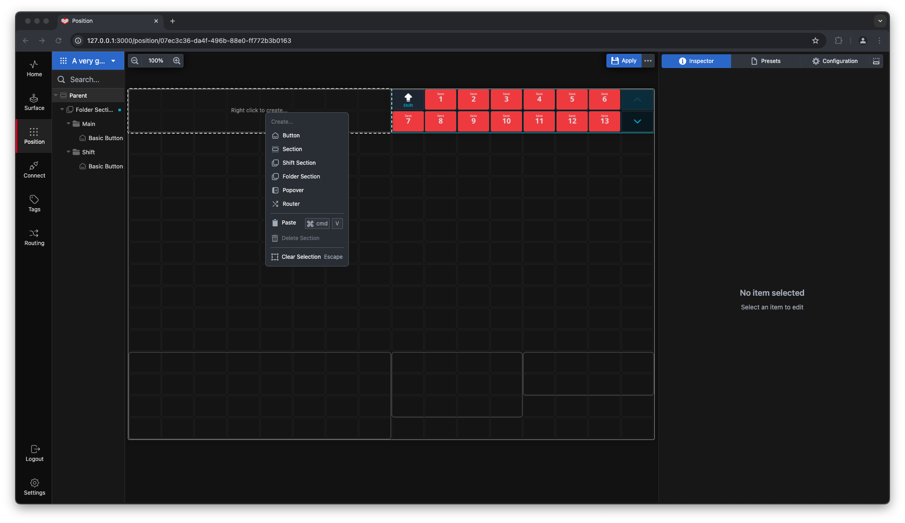
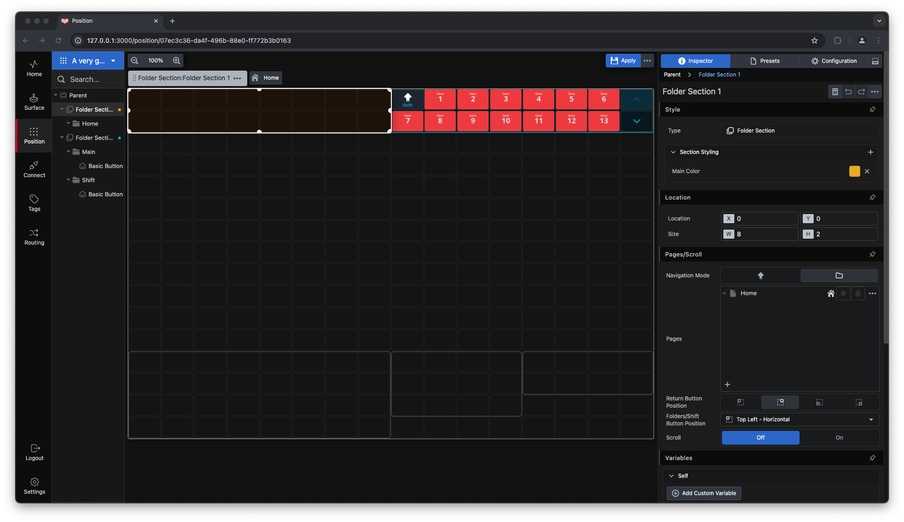
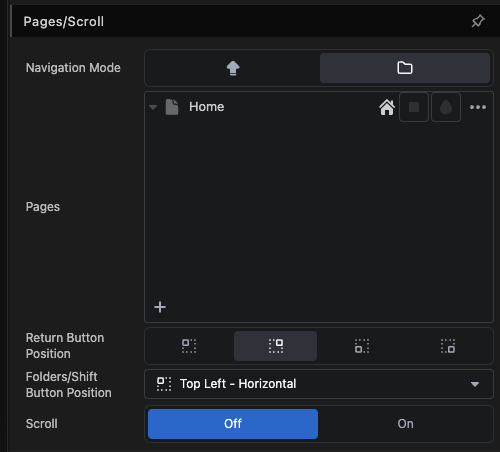
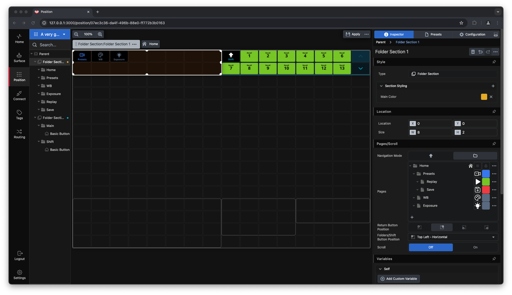
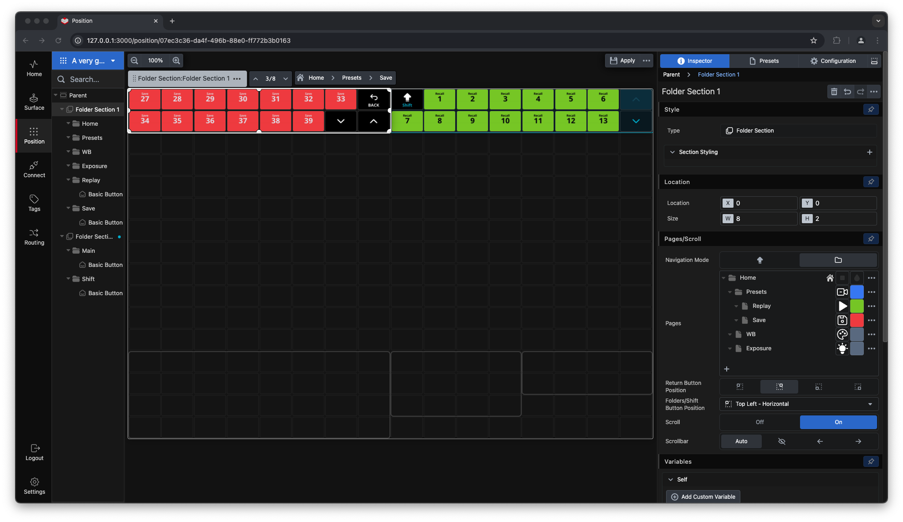

**Folder sections** function similarly to **Shift sections**, but with the added flexibility of multiple layers. You can navigate a folder section using the familiar method of folders and subfolders.

### Steps to Create a Folder Section

1. **Select Starting Cell**  
   Click on the cell where you want to start your folder section.

 
   
2. **Define the Section Area**  
   Click and drag to select the cells you want to include in the folder section.

    
3. **Convert to Folder Section**  
   Right-click within the selected area and choose "Folder Section" from the menu.

     
  

4. The selected cells will now be converted into a folder section. The empty section displayed represents the **Home folder**.

### Managing Folder Sections in the Inspector

- Navigate to the **Inspector** and open the `Pages/Scroll` dialog.  
  You will see the **Home** folder listed. To add subfolders, click the `+` button in the bottom-left corner of the `Pages` dialog.
  

- As you add pages or subfolders, a familiar hierarchy forms in the `Pages` dialog. You can:  
  - Rename folders.  
  - Change colors and icons.  
  - Modify the folder layout order (e.g., left-to-right or top-to-bottom).  
  - Adjust the return button within each folder.  

- Additionally, you can utilize the `Scroll`/`Overflow` function within subfolders to fit more buttons into the same cell area.  

