The `Router section` is an automated feature that populates itself with buttons similar to a standard XY router panel, based on the router-compatible connections you have. You can customize the `Router section` using `Filters` and `Tags` to perfectly match your environment.

---

### Steps to Create a Router Section

1. **Select the Starting Cell**  
   Click on the cell where you want to begin your router section.  
   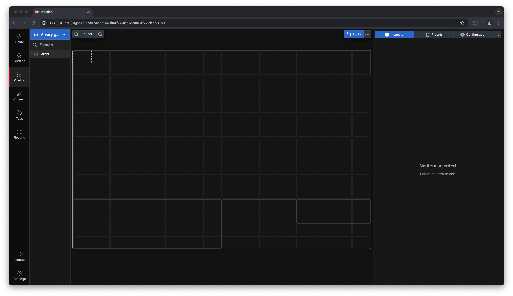

2. **Define the Size of the Router Section**  
   Click and drag to select the cells you want to include in the Router Section. Note that there are minimum size requirements: at least 6x2 cells. However, this size is not very practical as there are six mandatory buttons in a `Router section`. In this example, we select a 16x2 cell area, which can be resized later if needed.  
   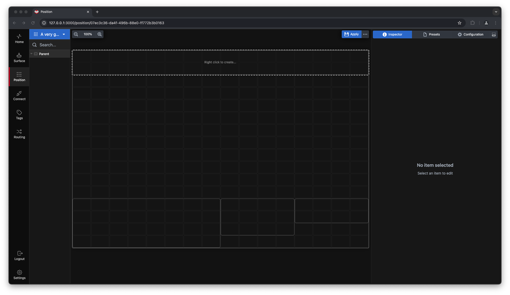

3. **Convert to Router Section**  
   Right-click within the selected area and choose `Router` from the menu. If the selected area is too small, the `Router` option will be greyed out.  
   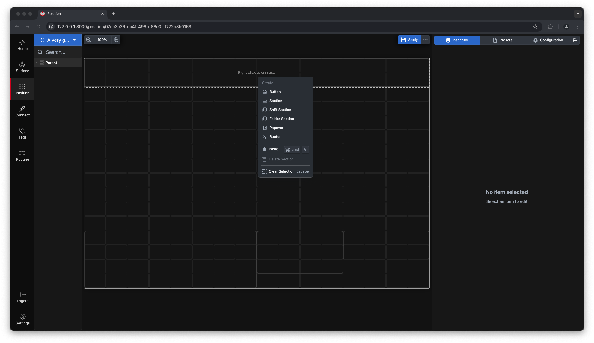  
   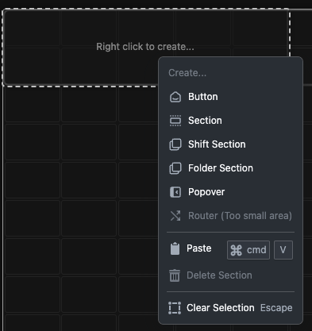

4. **Router Creation**  
   The selected cells will now be converted into a `Router section`. It will automatically populate with all `Router Enabled` connections, along with Filter, Take, Delete, Auto, and Shuffle buttons.  
   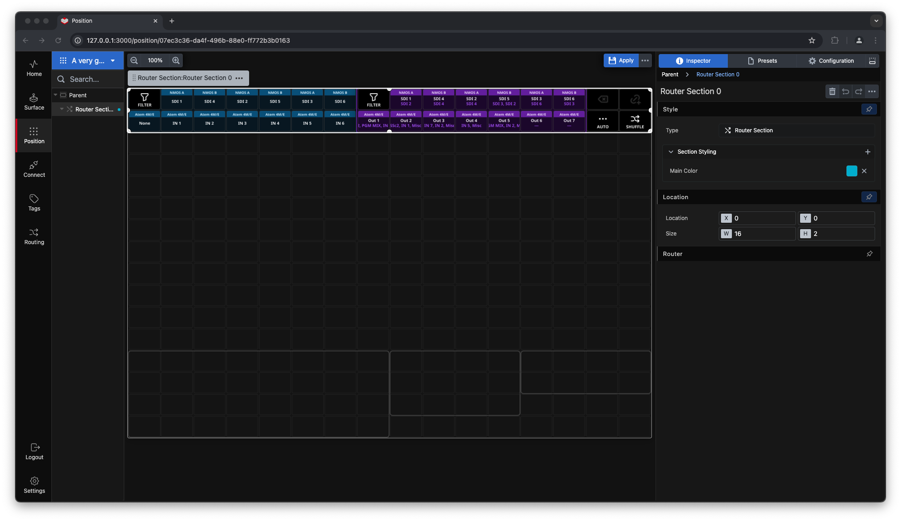

---

### Router Layout Options and Settings

The Router Inspector provides layout options and settings for your Router Section.  
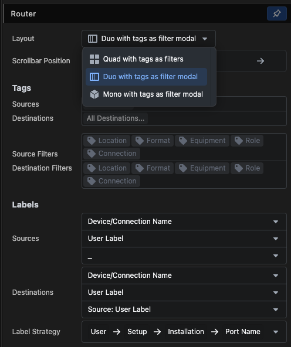

1. **Default Layout (Dual)**  
   This layout features two scrollable blocks for Sources and Destinations, with buttons to access filters in each block.  
   

2. **Quad Layout**  
   In this layout, filters occupy two blocks, and Sources and Destinations share the remaining two. This setup is ideal if you frequently use filters and have a large workspace, such as three stacked Stream Deck Studios.  
   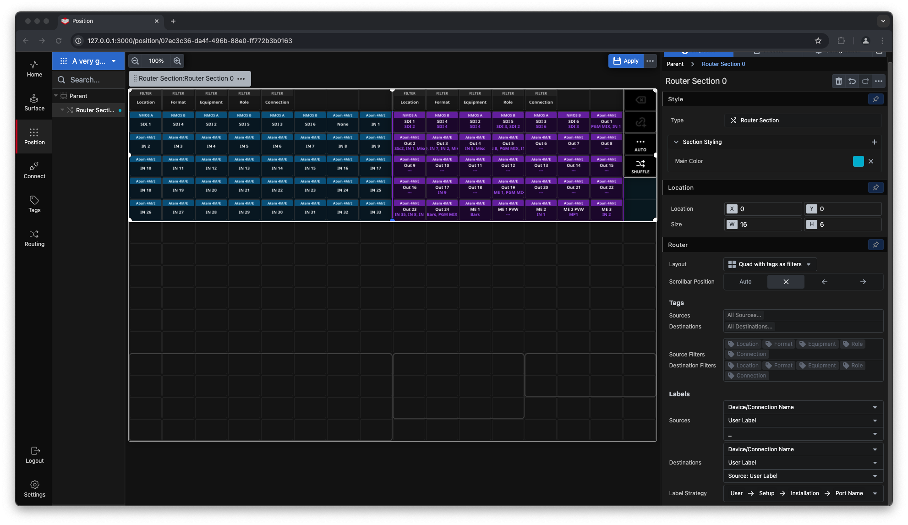

3. **Mono Layout**  
   This layout dedicates most of the button surface to either Destinations or Sources, with a button to toggle between the two.  
   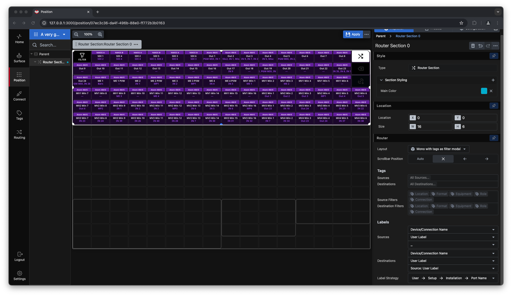

---

### Filtering and Tagging

The Router automatically filters your `Sources` or `Destinations` as you interact with them.  
In the example below, selecting **SDI1** on **NMOS A** as a `Source` filters the `Destinations` to show only the compatible NMOS destinations in our demo setup.  
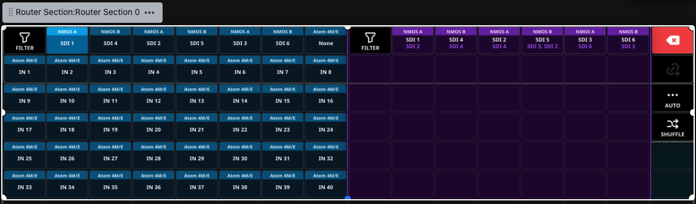

You can refine filtering by using the filter buttons. The filter tags shown are system defaults, but you can add custom tags in the `Tags` Page of Buttons.  
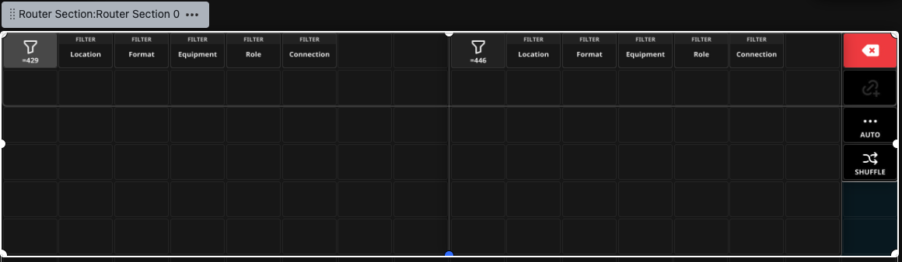

---

### Advanced Routing with Shuffle and Auto

With the `Shuffle` and `Auto` buttons, you can control which components of a source are routed to a destination. Note that not all devices support component splitting; for instance, NMOS devices typically allow this by default, whereas budget routers may not.  
Below is an example of a two-part route:  
- The Video component is routed from **SDI 1 Source**.  
- The Audio and Data components are routed from **SDI 4 Source** to the **SDI 1 Destination**.  
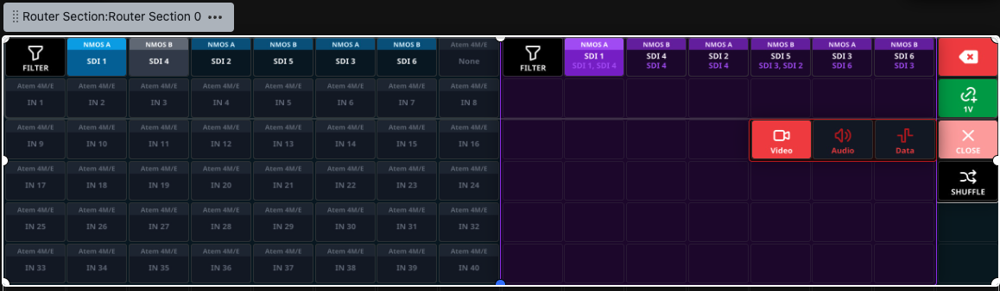  
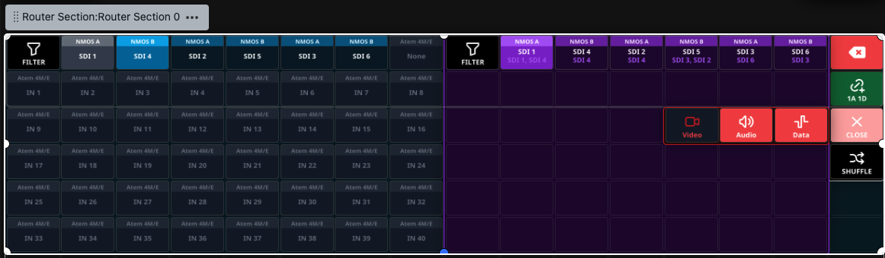

Using the `Shuffle` view, you can achieve the same outcome. Press the purple button to toggle between active sources and destinations.  
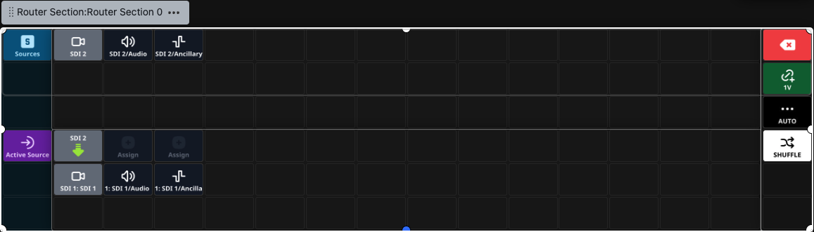

---

### Router Inspector Options

The Router Inspector allows you to refine and customize the Router Section:  
- **Tags**: Select which Sources and Destinations to include and configure available filters.  
- **Labels**: Specify what appears on the three available text lines on each button for both Sources and Destinations. The label strategy dialog is detailed further in the `Routing` page.  
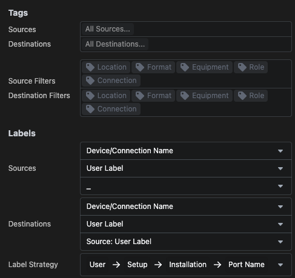

The `Router section` works closely with the `Routing` and `Tags` pages. Familiarizing yourself with these will unlock the full potential of the Router Section.

---