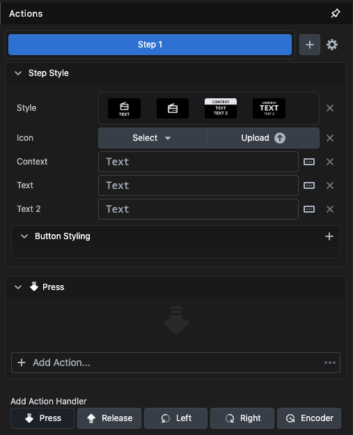

A **Button** is the basic action handler you push it and something happens, it has a lot of properties, and we will go through them step by step.

The first ting to notice is the *8 dots* in the top left corner of a selected **Button** this is the *Handle bar* if you hover your mouse over it, it will change into an open hand, and you can click to grab the button and move it around the **Canvas**.

**Label** in the top right corner is the name of the **Button** in the tree view.
**Style** is how the layout on the **Button** will be presented.
* The first is a combination of an Icon and one line of text. (Default)
* The second is icon only.
* The third is 3 lines of text where the top line has its own color properties.
* The fourth is 3 lines of text where the middle line is bigger than the others.

**Icon** will present you with a dropdown of multiple different icons, you can use search to find an appropriate icon.

You can also `click`the `x` at the end which will give you the option to upload a **PNG** file as an Icon
  

The text fields will vary depending on which button style you have chosen

**Context** Is the top line in the Third and Fourth button style  
**Text** Is the middle line in the Third and Fourth button style and the only line in the First button style
**Text 2** Is the lower line in the Third and Fourth button style

At the end of each text box there is a **Variable** selector button, which will bring up the variable selector dialog

Here you can browse and select from all the different variables available on the system

 

**Button styling**

**Location**

**Flow** determine how a **Button** behave or are positioned relative to other elements on the **Canvas**

- **Float** Used to position an element in the first available slot, starting from top-left. The go-to for a dynamic layout.
- **Static** When you want full customization of where any button is placed. Set X / Y. (Default)
- **Anchor** Used to automatically position an element in any corner. Allows a section to be easily resized while keeping an element in any corner.
- **Fixed** Used to automatically position an element in any corner, but will not be affected by scrolling. (Sticky)
  
**Action**

**Action** is where we connect the **Button** with **Connections** or other functions inside **Buttons** itself. For this example we will use the **Button** to perform a **Action** on a Blackmagic design Atem switcher. There are 5 action handlers to choose from 

- **Press** which will perform the **Action** when you press the **Button**.
- **Release** which will perform the **Action** when you release the **Button**.
- **Left** that will *move* the **Action** to the **Encoders** on she **SDS** and perform the **Action** when it's rotated left.
- **Right** that will *move* the **Action** to the **Encoders** on the **SDS** and perform the **Action** when it's rotated right.
- **Encoder** that will *move* the **Action** to the **Encoders** on the **SDS** and perform a **-Action** when turned left and a **+Action** when turned right.
  
  

For this example we will use the *Press Action Handler* 

**Click** on *+ Add Action* and chose a **Action** from the popup menu this menu can be very extensive with a lot of **Connections**.
You can also **Click** the **...** menu to bring up a search and filter selection menu

**Click** on *ME:Set Program Input*

We have now created a **Button** that when pushed will set the Program bus on the Atem to input 1.

Let's jump back to the Style properties quickly and change the text on the **Button**

Notice that when you start typing the $ **Buttons** will start suggesting possibilities for you. Use a ` . ` to separate the different parts of the variable. Or you could select it from the variable selector by pressing the button on the end of the text box

Let's go back to the **Action** dialog

There is more to this than first meets the eye, notice the *+* sign after *Step 1*, by `Clicking` this you will add steps making the **Button** a little "playlist" which will perform one action after the other each time you press the **Button**. Each step have their own **Style** and **Action** dialog options. You can also Reorder, Duplicate and Delete steps and if you press the `Cogwheel` there is an option to auto progress through the steps following the Delays set in the various actions

 

You can also add more **Actions** in the same step by **Clicking** the *+ Add Action* at the bottom of the dialog. And you can add a delay from the press of the **Button** to the **Action** fires, You can choose between using absolute and relative delays under the `cogwheel` at the top of the action dialog.

**Absolute Delays**
All actions run a certain number of milliseconds from the start of the button press. Actions without a delay start immediately. This is the default behavior.
  

**Relative Delays**
Each action runs a certain number of milliseconds after the previous action started.
 
The default for all actions are Absolute delays

---

Now we will look into the **Feedback** tab of the **Action** dialog

**Click** the *+ Add Feedback*

**Click** on *ME: One ME Program source* this will bring up the following dialog.

Here you will be presented with options to alter the text and style of the **Button** if the choices in *Options* are True (or False if you use the invert button) in other words if Input 1 is chosen as the source on the ME one Program Bus

In `Button Styling` the red background colors, will make the **Button** background red every time Input 1 is live on the Program bus of M/E1.

If you have been following along in **Buttons** you may have noticed this dialog box popup every time you press the **Shift** button

This will enable you to test your **Buttons** without a **Surface** connected. So hold **Shift** and **Click** on a **Button** to execute its **Actions**.

Or you can press the little flash in the top bar of the action dialog

There are a few more options in the properties list of **Buttons**, but we will get back to them at a later stage. Now let's jump to a method that for many connections makes configuring a **Button** much easier and much faster. **Presets**
