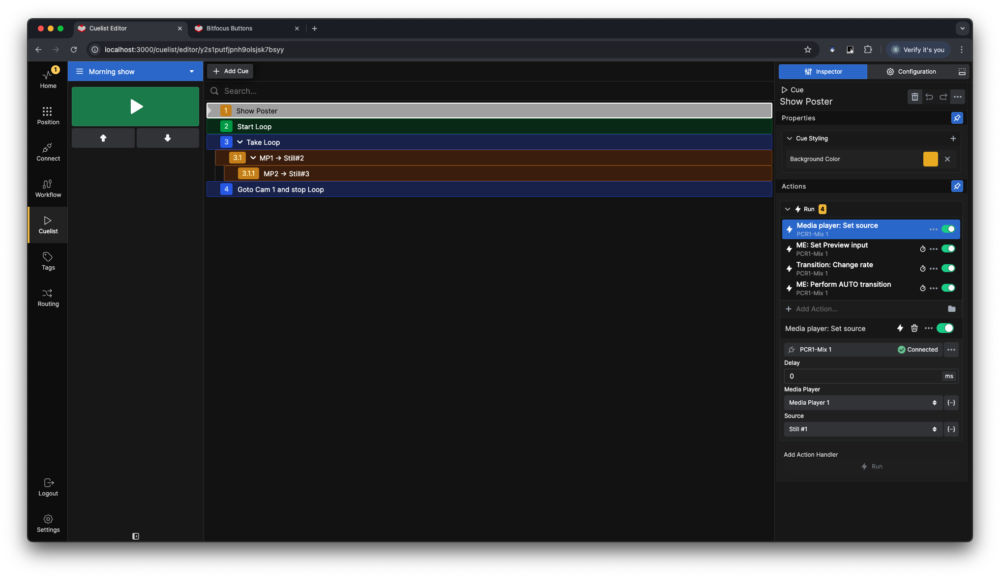
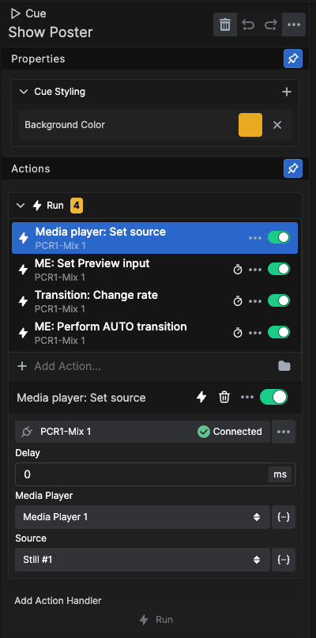
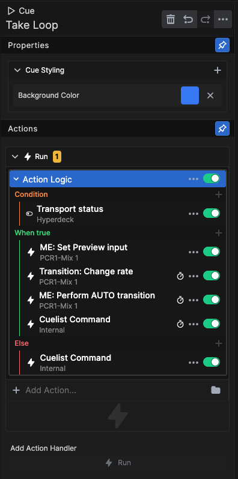
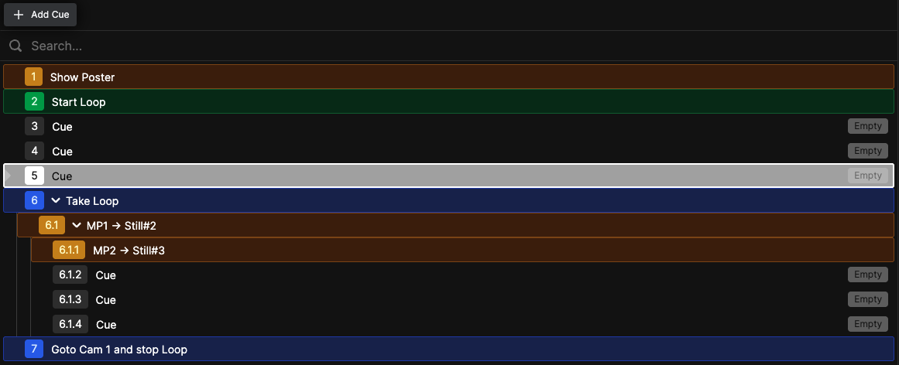
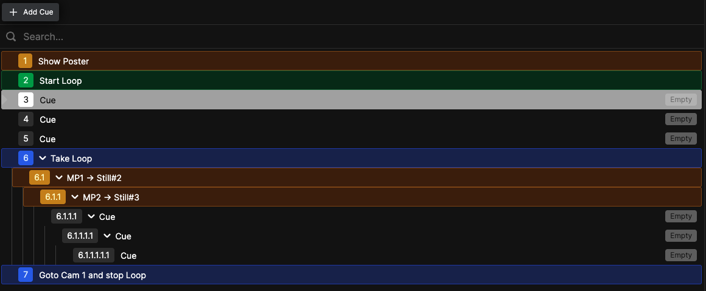
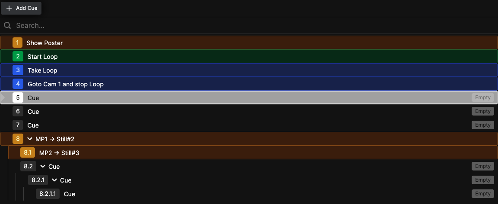

**Cuelist**

In the cuelist you can build all cues (lighting looks, camera shots, video clips, audio triggers, etc.) in a list format much like a spreadsheet or newsroom rundown. Each row represents a cue, and each cue can execute a number of actions either all together or timed. It can also control the advancement of the cuelist itself. 

Each cue can have a name and a color, and you can stack as many actions as you like in each cue.

You can also use conditional logic to control the flow of the cues, where a Condition will be tested for a true or false value determining which actions will be executed. 

You can add cues and sub-cues after the currently selected cue by clicking the **+ Add Cue** button.

You can also make a cue, a sub-cue of another cue. By dragging and dropping it on top of the cue you want to make it a sub-cue of.

To reorder cues drag and drop it between the cues where you want to insert the cue. The cuelist will auto renumber on any changes to the order.

> **TIP!** There are Internal Actions to navigate the cuelist.