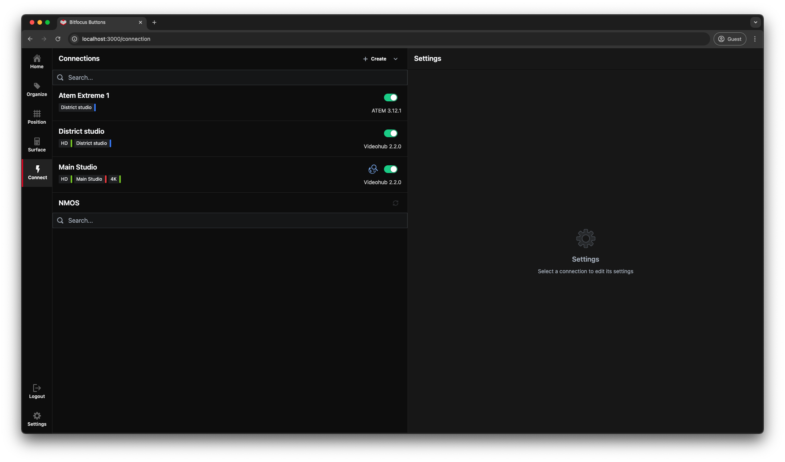

Connect is where we connect **Buttons** to the outside world switcher, routers, software, hardware and all other thinkable and unthinkable options.

When we first start Buttons there may be some autodiscovered **NMOS** equipment here, but the top portion will be empty and this is where any connection Modules will be as in the picture above on. The first time you start or if you wipe your database you will have to download the module library. To do this push the little down arrow to the right in the top of the left pane shown below.

You will have to be online to do this as **buttons** fetches the library from the Bitfocus repository. this can take a bit of time depending on your connection speed. When the download has finished you can push the *+Create* button.

You will then be presented with an extensive list of possible connections. The Modules are named "Company"-"Product"-"model" some modules will cover several models I.E. the *Blackmagick Design-ATEM* Module will cover all versions and models of the Atem switcher range. There is a dropdown menu connected to all modules and this is to select the Module version the latest version is default.

Let's add the latest version.

As you can see from the picture the module comes in disabled with a default name, and it shows the version NR. Push the *Enable* button in the right pane.

This will load the module configuration in the right pane at the moment it shows that the module is disconnected and there is a flash warning sign in the left pane for the module, This is because the module has no idea where to find the ATEM on the network. Let's put in an IP address to a know Atem switcher.

 
 The top row now shows connected and the warning sign i the left pane has disappeared, There are a few other options here, but most should be quite self-explanatory. The amount and type of options will differ from module to module, but they will all have some way of connecting to the Hardware or software. At the bottom of the screen there are some expandable options to view the available *Variables* and *Actions* for the module.

 

 We are now ready to use the new connection in a position setup.
