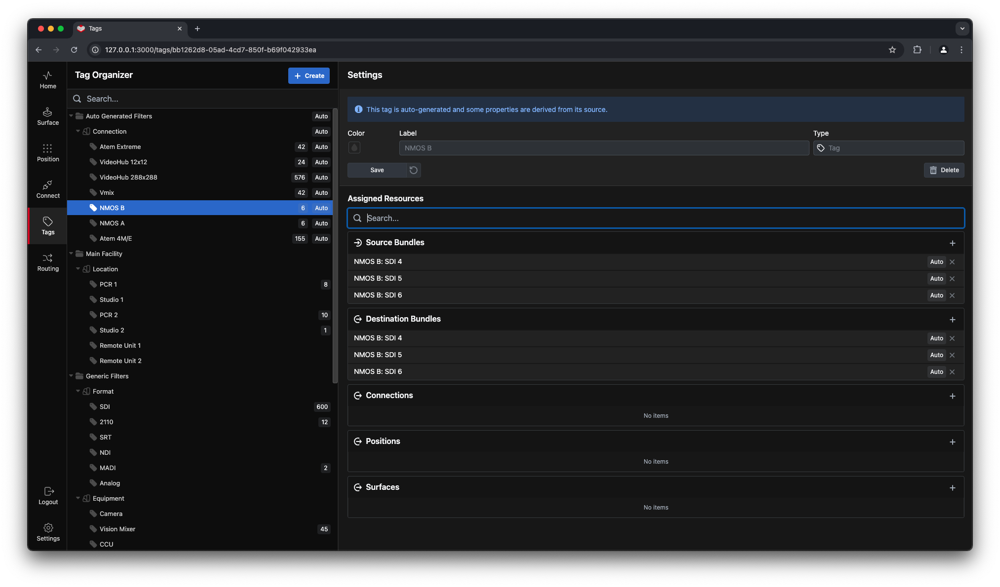
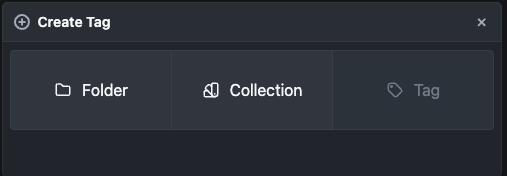
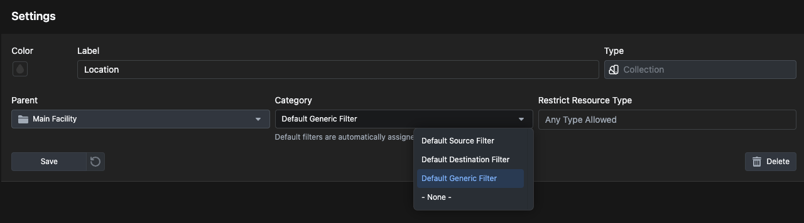

**Tags** are keywords you can add to the different elements of **Buttons** to create an organizational structure, or filter search results

Large implementations of buttons can greatly benefit from additional organizational structure, here you can add **Tags** and structure according to your needs.
For example "studio name.", "room number or name.", "floor plan number or name." and so on. Any organizational value that will make it easier to group equipment, software, positions, workstations and units together.

**Buttons** will automatically add tags as you add connections and other elements to your system, we have also added some other organizational tags that will appear on the Tags list. Feel free to change or add to them as needed.

When you click on the`+Create`the following dialog will appear, and you can choose which Tag element you want to create.

- **Folder**: These are for organizing your Collections in to logical groups 
- **Collection**: A Collection can contain multiple Tags. Collections are used to group Tags together, And to create filters.
- **Tag**: This will create a new Tag. Every Tag has to belong to a Collection 

By default, you can assign any tag to any resource, but you can also restrict a Collection to one or more resource types.

You can also define what category the collection belongs to, which controls where the tags will be automatically assigned
