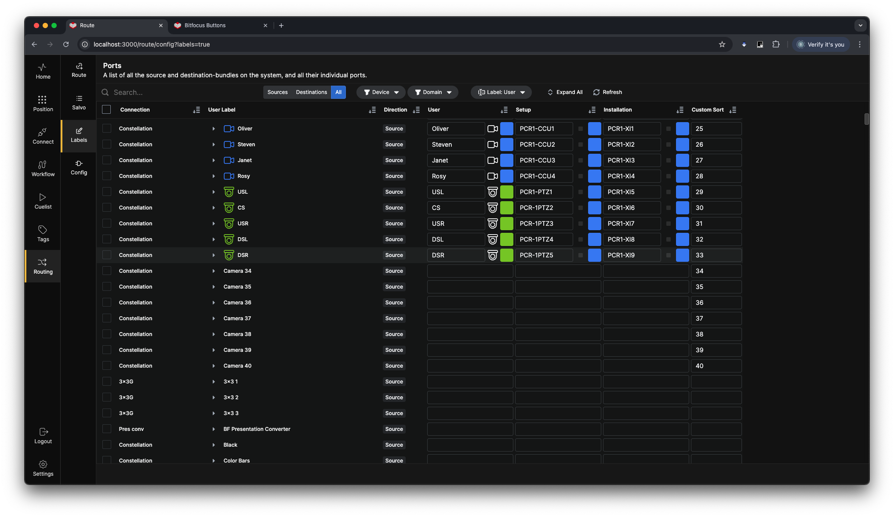
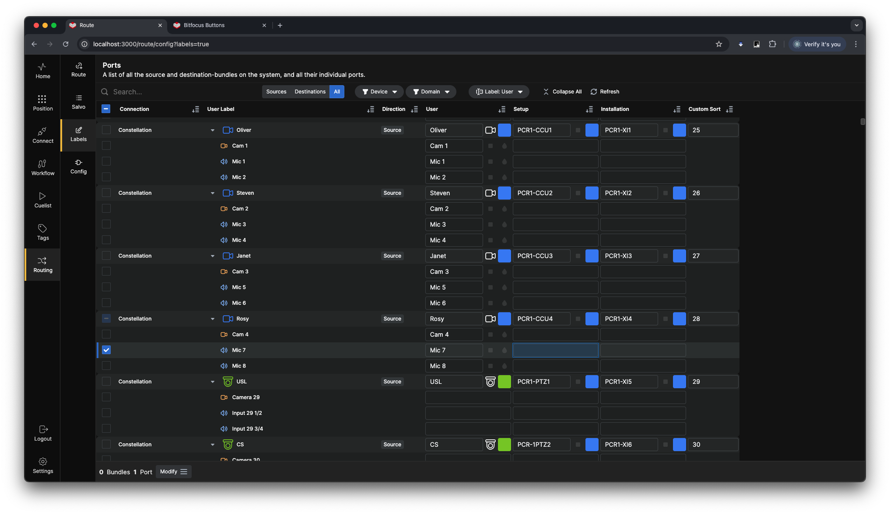
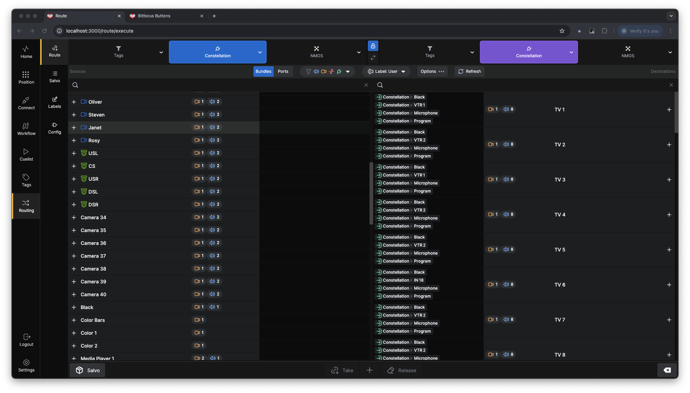
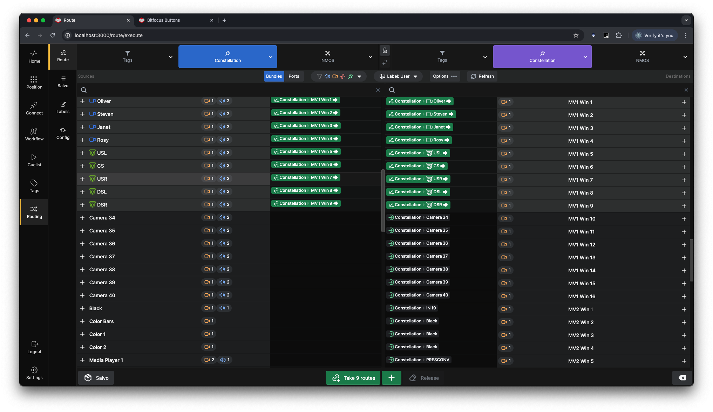
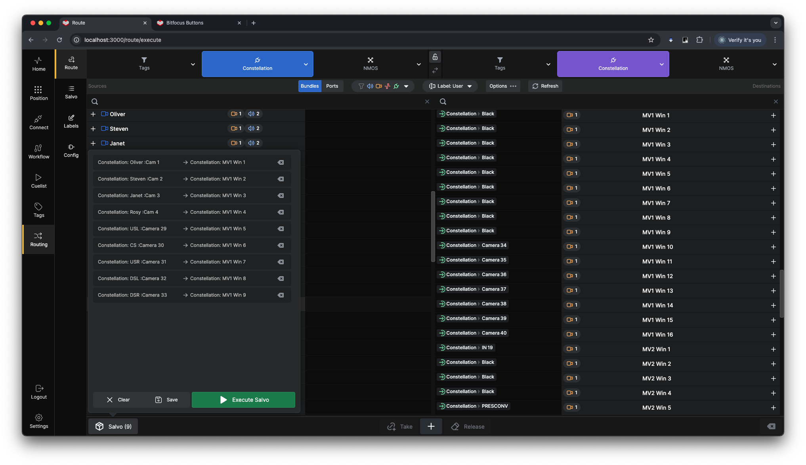
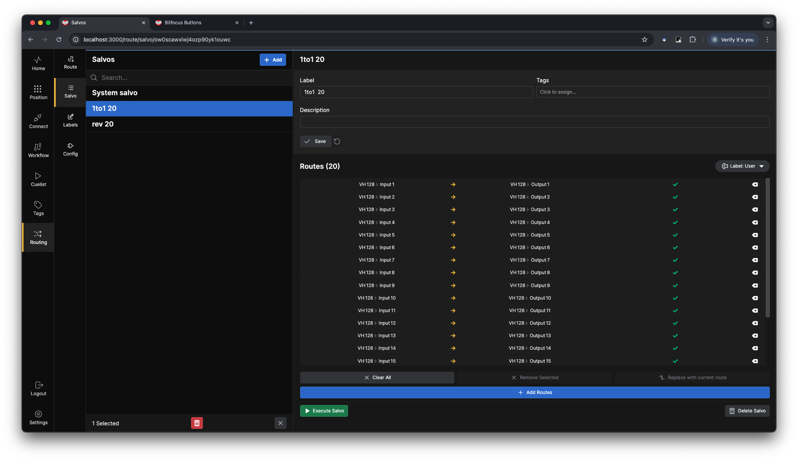

**Routing UI**

The Routing UI consists of 4 pages
- **Route:** On this page you can Set up and Execute routes or store them as Salvos.
- **Salvo:** Here you can create edit and execute Salvos.
- **Labels:** Lets you set up custom Labels, Icons and Colors for the Ports and you can also define the Custom Sort 
- **Config:** This Page will give you a full overview of all the Bundles and Ports of the Router compatible connections in the configuration.

**Config**

This page is a read only overview over all Ports and Bundles in the routing system. You can sort the Table by clicking on the Column headers. Filter the view by Sources or Destinations, By Device and Domain. You can also expand each of the Bundles to see alt the ports in the bundle. 

**Labels**

This page lets you assign customized labels to the Ports and Bundles in the Buttons Routing System. All connections have a **Name** Label that is fetched from the connection, and some connections also have a user definable label, we fetch that as well as **Ext Custom Label**. In addition to those Labels you can make a **User**, **Setup** and **Installation** Label for each Bundle and Port in the configuration. The Custom Sort column allows you to enter sorting criteria for sorting the Bundles and ports both in the router UI and in the router section.
In addition, you can also assign Icons and colors to the Bundles.

**Route**

In the Route view you can Route sources and destinations in a dual column style screen. The left part of the screen will list the chosen destinations and the right part will show the chosen sources. You can route from Left to right or right to left single bundles or even single ports by expanding the bundles by clicking the **+** all the way to the right and all the way to the left. Or expanding all bundles by clicking the Ports button. The Padlock button at the top of the screen will lock the source and destination selection dropdowns together for easier selection. The double arrow button below the padlock will swap the selection between sources and destination, very useful for Nmos connections with both senders and receivers in the same unit.  

You can select multiple Sources and destinations and either take the route directly or press the **+** to add them to a salvo.

The Route salvo Popup allows you to remove single routes, clear the whole salvo, save the salvo or Execute the salvo. You can add to the salvo multiple times with multiple connections to make a system-wide salvo.

**Salvo**

In the Salvo view you can create Salvos from scratch, Edit existing salvos and execute salvos.

> **TIP** There are Internal Actions and Feedbacks for both Routes and salvos, Allowing for Single button execution of Both Complex Routes and Salvos.

