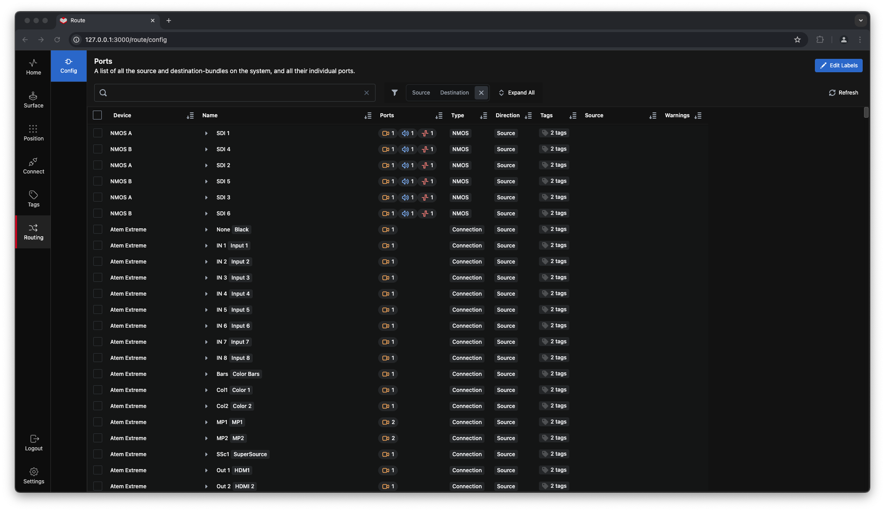
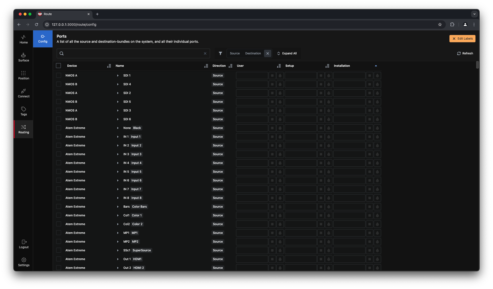
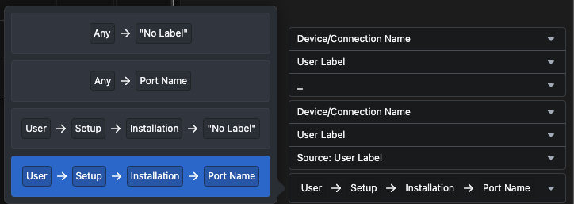

On this page, you get an overview of all the different sources and destinations associated with your router-enabled connections.  
  

You can sort the list by any parameter, and any potential warnings detected by the system will also be displayed.  

If you **click** the `Edit Labels` button in the top-right corner of the page, you will be taken to the labels editor.  
  

### **Label Editing**  

On this page, you can edit the labels that will be shown in the router section:  
- **User**: A customizable label for specific use cases that can be changed without altering the entire system.  
- **Setup**: A default label usually set by the system administrator.  
- **Installation**: A label typically imported from the connection, if available.  

### **Label Strategy**  

The `Label Strategy` button in the inspector for the router section allows you to configure how labels are displayed.  
  

With the chosen strategy, the `Port Name` will be shown as a label if no other labels are defined. Label priority is as follows (from highest to lowest):  
1. **User Label**: If defined, this will be displayed on the button in the router section.  
2. **Setup Label**: Used if no **User Label** is set.  
3. **Installation Label**: Used if neither a **User Label** nor a **Setup Label** is set.  
4. **Port Name**: Default fallback if no other labels are available.  