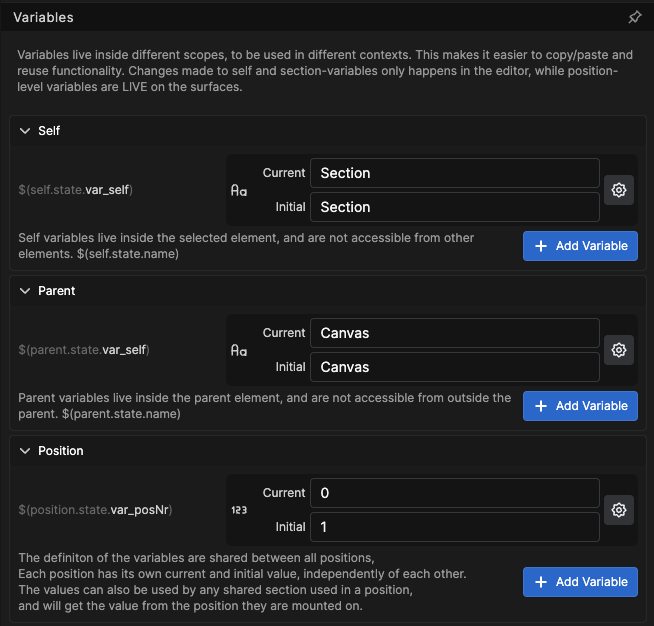

## What are Variables, and How Do We Use Them?

 A **variable** is like a labeled container in the computer's memory. Imagine a box with a name on it—for example, "Score" or "Username." Inside this box, you can store different kinds of information, like a number, a piece of text, a true/false answer (also called a boolean), or even a piece of code. In Buttons, a variable is that labeled box, and the "things" you put inside are the values.
The main thing about a variable is that the information it holds can change. For instance, a "Score" variable might start at 0 and then go up as a player earns points in a game.

## Naming Your Variables

Variables should be given clear, descriptive **names** (like "score," "username," or "channel"). This makes it easy for users to understand what kind of information they hold, and to refer to them later in other parts of Buttons. It's important that each variable has a unique name where it is visible. In other words, no two variables that are visible in the same place can have the same label. One way to manage this is with **Variable Scope**.

For small, single-user setups, scope might not matter too much. But when the configuration grows, and you have multiple Positions with the same or similar connections, things can get complicated very fast. So, it will be important to make decisions about both the Labeling and Scope of your variables.

## Understanding Variable Scope: Who Can See What?

The **scope** of a variable determines where the variable is visible or available for use. If you're familiar with programming, this explanation might seem a bit too simple, as there are usually other factors connected to variable scopes, such as lifespan. However, as a general rule, most user-facing variables have at least a runtime lifespan, and some also have a Persist option, which saves the value of a variable through a shutdown or restart of Buttons.

If every part of a program can see and use a Variable, we usually say that it has a **Global scope**. But if only a small part, like a function, can see and use a variable, we say that it has a **Local scope**. This is true for Buttons as well, 

---

## Different Variable Types in Buttons

  **Connection Variables:** These are global to Buttons, meaning all parts of Buttons can see and use them. Connections are not able to see or manipulate other connections variables directly. Buttons can, manipulate variables in one connection based on variables from another connection. Connection variables are manipulated through functions built in to the connections and made available as Actions, Feedbacks and Variables

The Variable key is set in the config view of the connection. And will be a part of the Variable name.  

If you have more than one of the same connection you must have different Variable key's for each of them. It's good practice that the Label and Variable key of a connection have some resemblance, so the connection between the two are easy to understand.

Connection variables can be viewed in the variable view of the connection, and here it's also possible to copy the full Variable by clicking on the clipboard at the beginning of the variable.  
Here is an example of what the full variable looks like `$(S1Atem1me.device_ip)`  
As you can see the full name of the variable is a combination of the variable key and the variable name.
The variable view also have a column showing a description of the Variable, and one showing the current value of the variable

---

**Section Variables:** are actually a combination of two variables: the **Self Variable** and the **Parent Variable**.
 - **Self Variables:** These are variables created inside a button or a section and are local to that button or section. They are not visible to other buttons or sections and cannot be used outside the button or section.
 - **Parent Variables:** Is a Self variable of the Parent element, and it's made available to the child element through the Parent variable.

You can create multiple self and parent variables in each element, but they must have unique names within that element.
You can freely reuse variable names from self and parent elements in other elements as they have a local scope and are not accessible from outside those elements 

    

A Self variable is defined in the inspector of the element that you want to hold the variable. You can also define A parent Variable in the same element, that will then become a Self variable of the parent element.

To try and illustrate the relationship between Self and Parent variables we have placed 2 copies of a button onto the canvas, the left one is inside a section and the right one is placed directly on the canvas.  

If we look at the Variable definitions for the Left button we see that we have a self variable called `$(self.state.var_self)` and the value of that variable is "Button 1" and the right button has the exact same variable with the same label and the value "Button 2" this is only possible because the self variable only lives inside the button. So they can coexist and hold different values. The variables are not visible to each other.  

  

If we look at the Parent Variable we see that they to have the same variable label but different values indicating that they are not in the same scope. They only live inside the parent element in this case the section for the left button and the Canvas for the right button, and they are only made available through the parent variable.  

 

When we take a look at the Section we see that the self variable for the section, holds the same value as the parent variable for the button inside the section. This shows you that a Parent variable in an element is a self variable of the parent element.  

The two buttons we have used as an example are actually just two copies of the same button using variables as labels, as shown in the illustration above. 

---

  **Position Variables:** These are defined as global variables. This means all positions have the same variable definitions, but each Position has its own Current and Initial value, independently of each other. The values can also be used by any shared section used in a position and will get the value from the position they are mounted on.

Configuration Pane.  

Inspector Pane.  

A Position Variable can be defined either in the configuration for the position or in the inspector for any element inside the Position. When you create a new position variable in any position they will be available in all positions in the configurations. But the value of the variable will be individual for each position. And you will have to set the value for each position that you want to use the position variable. Making the Variable definition Global and the variable Value Local. 

The position Variable also have the ability to use a connection as a variable type.  

 Define the variable with the connection you want to use, for this to be of any use, you should have more than one connection that use the same module. In this example we have two Atem1me video mixers connected to our configuration.  
 

We can then use the variable to define which connection should be connected to the actions in a position.  

Make a button and use the **Set Position Variable** internal action to swap out the video mixer in use on the position. This can also be used with a shared section where the connection in use in the shared section is determined by the value of the position connection variable.  

 

---

 **Workflow Variables:** are defined as global variables and are available for both reading and writing from all over Buttons.

To create a Workflow Variable we go into Workflows and if we don't have any workflows we must create one, here we happen to have a Workflow called Variables, so we will use that one.

Inside the Workflow we can create a workflow variable by clicking and dragging a workflow variable node onto the canvas.  

  

This will bring up a dialog box where we have to give the variable a unique name. Remember that this variable will be globally available.  

  

After giving it a name you will need to click apply to edit the variable.  

 . 

The Default type of the variable is String, but you can change it to Number or Boolean, depending on what the variable will be used for.
You can set an initial value in the variable, which will be the starting value each time buttons is restarted, or you can set the value to Persist which will save the current value of the variable to the configuration bringing it back after a restart. If you choose the type as either Number or Boolean you will have to set a Current value as those types can not be "undefined". We will get back to how to use the variable in a Workflow, but if all you needed was to make a Global variable, your work here is done.  

  

There is one more setting that will affect the variable, and that is the Variable Key. You will find it in the settings for the Workflow. By default, the variable key will be the same as the Workflow name.

___

Now let's have a look at the different places we can find and use the variables. Most text boxes in the inspector have a small folder button at the end of them  clicking on the folder icon will bring up the Variable browser, and from here you can pick and choose from all the variables available to that text box.  

  
 
From the browser you can insert a variable as a label in a text box.  

  

You can also insert a variable as a value in an action.  

  

If you need to adapt a variable you can use an expression to calculate a value from the variable. The expression dialog will suggest options for you as you write, making it easier to form correct expressions.  

  

You can also use functions in expression for example `concat` which lets you combine multiple variables and text.  

  

To change a value for a Workflow variable there is an Internal action called **Set Workflow Variable**.  

  

The **Set Section Variable** internal Action will set the value of a parent variable in the button that uses the Action,  
which means that it is actually setting a self variable of the section that holds the button.  

  

The **Set Position Variable** internal Action will set the value of a position variable in a position that the action is executed within.  

  

