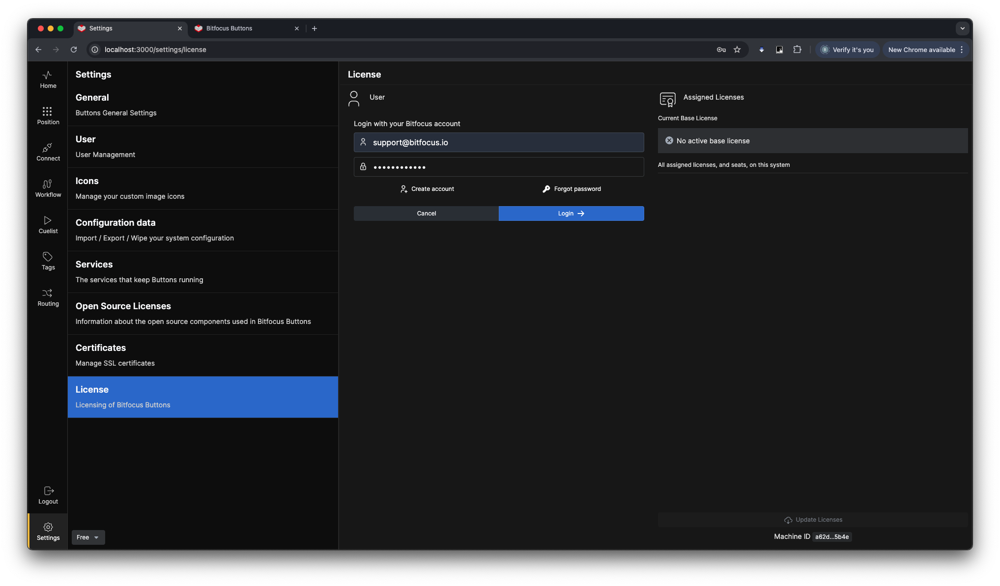
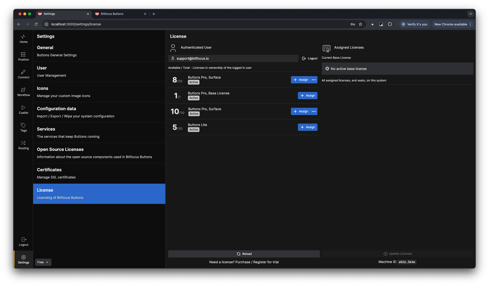
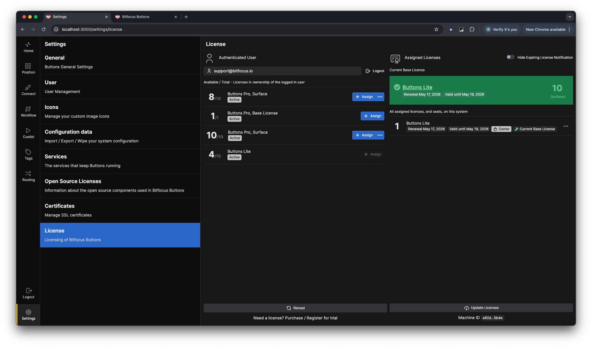
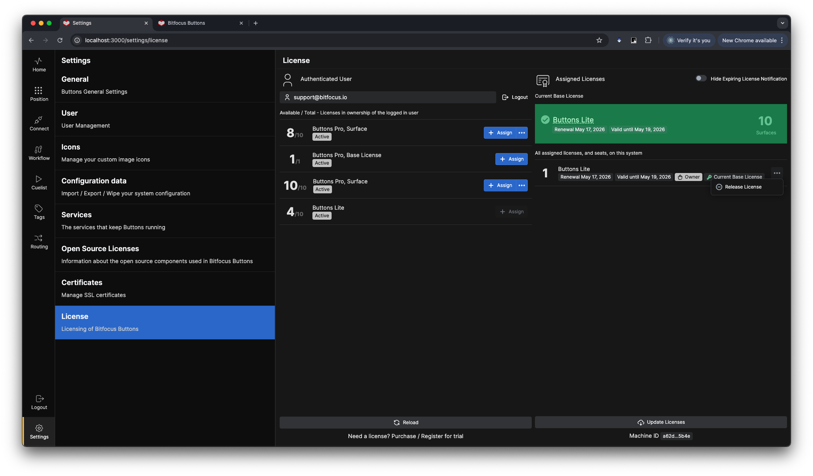
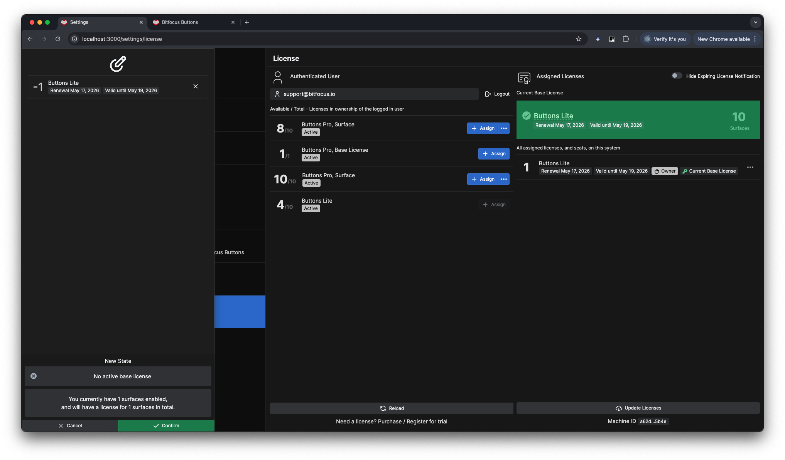
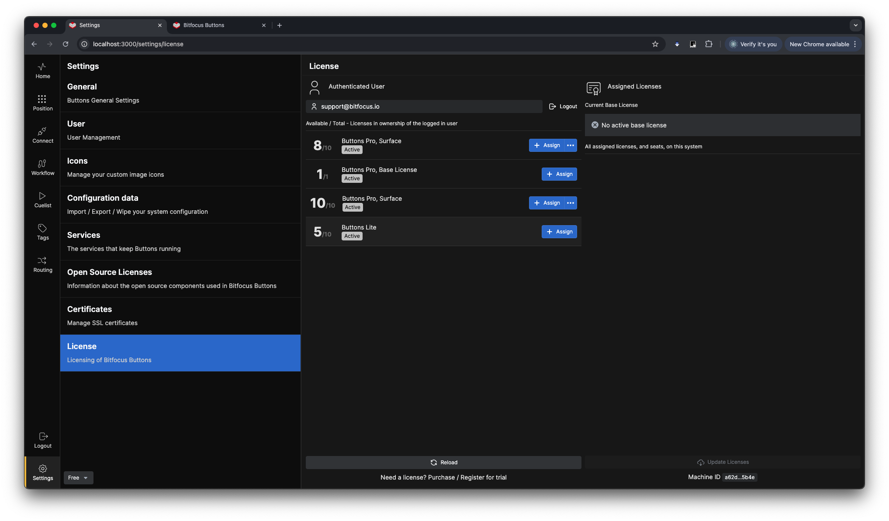
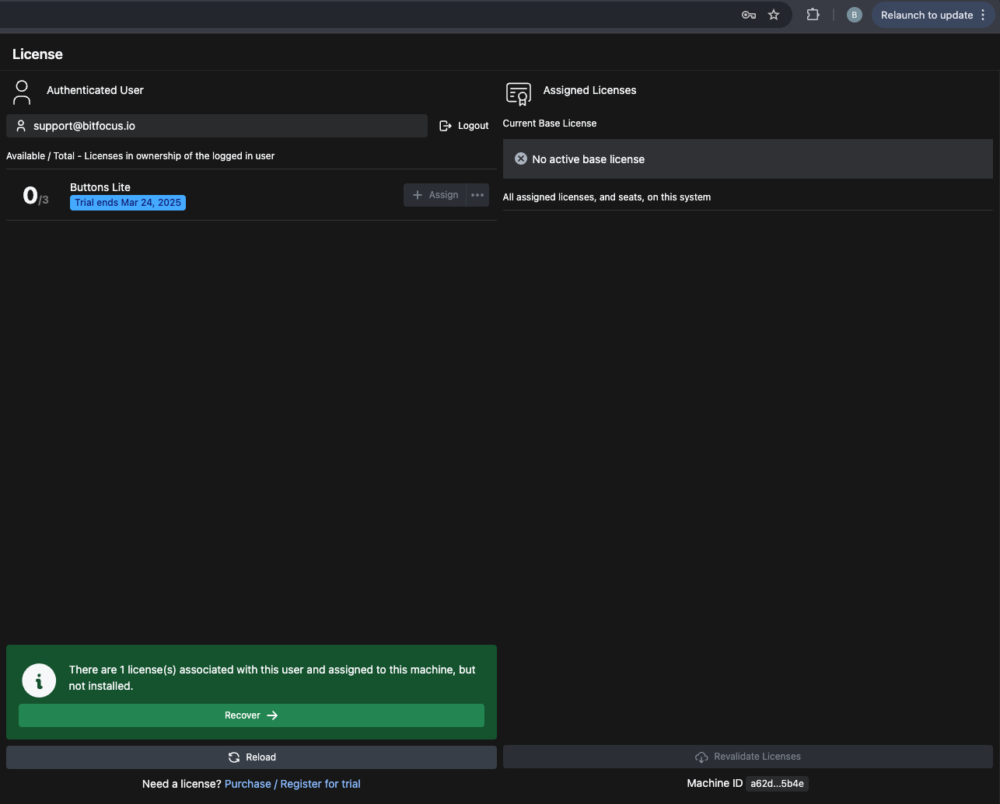

**Adding a License**  
To acquire a license for Buttons, log in to [user.bitfocus.io](https://bfoc.us/i90jvygd91) and navigate to the **Buttons** category. You will be guided through the process of purchasing a subscription for **Buttons**.  

Once you have obtained the required license, navigate to the **Settings > License** page in the Buttons user interface.  
  

Log in using the same account you used to purchase the license.  
  

After logging in, a window will display the number of available/total licenses associated with your account.  
  

Click the `+Assign` button to assign a license to the current machine. A dialog box will appear on the left side of the screen. Review the assignment details, and if everything looks correct, click the `Confirm` button in the lower-right corner of the dialog.  
  

You have now successfully licensed this machine for Buttons.  
  

---

**Releasing a License**  
To release a license from a machine, click the `...` button on the right-hand side of the screen and select **Release License**.  
  

If you have any connected surfaces linked to Buttons, you will not be able to release all licenses. A dialog box will inform you of the actions required before releasing the license.  
  

If your remaining licenses cover the connected surfaces, or if you have no connected surfaces, a confirmation dialog will appear. Click the `Confirm` button to release the license from the machine, allowing it to be assigned to another machine.  
  

In this example, the number of available licenses is updated to 2/2.  
  

---

**Recover a License**
If you for any reason happen to see this in the lower left on your screen on a machine that you know should have a license.   

   

Go to the license page as instructed earlier and log in to the Bitfocus user account that holds the license for that machine, and you will be presented with the option shown below. Just click on the `Recover ->` button and your license will be restored on to the machine.   

---

**Removing a License from a broken or lost machine.**

If your machine is broken or lost and a license is still associated with that machine, you can retrieve that license back to your accounts license pool by sending an email to [support@bitfocus.io](mailto:support@bitfocus.io). Include information about the **host name** of the machine you want to retrieve the license from, and please send the e-mail from the e-mail account that is associated with the Bitfocus user account, so that we can verify that you have the rights to retrieve the license.  